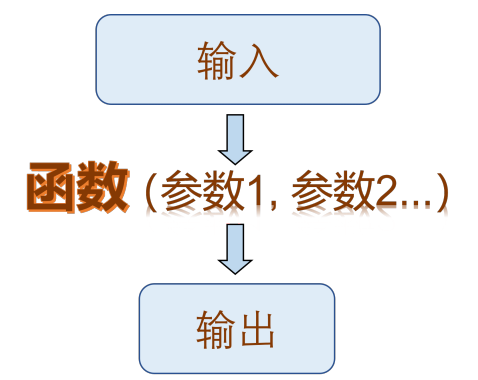
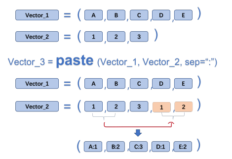
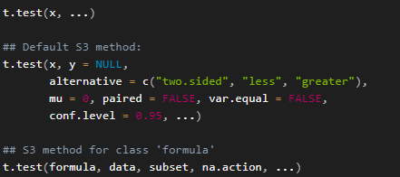
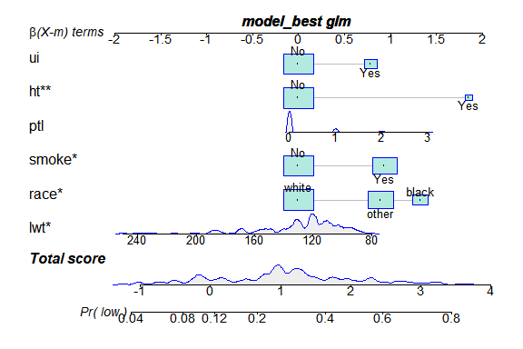
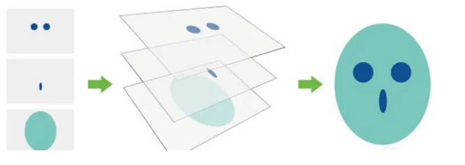
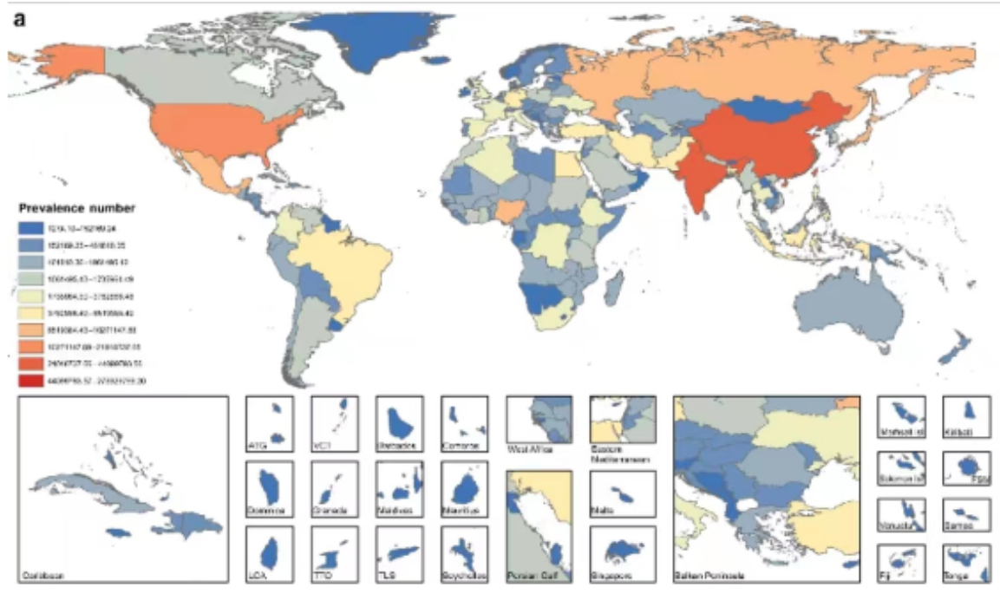

--- 
title: "GBD 笔记总结"
author: "杨 弘"
date: "2022-11-20"
site: bookdown::bookdown_site
knit: bookdown::render_book
output: bookdown::bs4_book
documentclass: book
bibliography: [references.bib]
biblio-style: apalike
link-citations: yes
github-repo: perlatex/R4DS-book
url: "https://yanghongxxl.github.com/GBD_yh_test/"
#cover-image: images/cover.jpg
description: "This book is an overview of how practitioners can acquire, wrangle, visualize, and model data with the R and Stan."
---


# 前言 {.unnumbered}
小菜鸟学习笔记，第一次尝试构建bookdown

<!--chapter:end:index.Rmd-->

# Base_R基础


## 基础拾遗

1.  窗口可以通过拖动分割柱移动，也可以使用快捷键控制。比如：**Ctrl+shift+1**(2\\3\\4)

2.  创建一个R脚本 ------**Ctrl+shift+N**

3.  快速注释------**Ctrl+shift+C**

4.  善于利用小标题实现功能分区（**ctrl+shift+r**）

5.  **ctrl+alt+r** ------快速插入代码框

6.  注释（Ctrl+shift+c）； \# ；

7.  赋值（Alt+-）： =, \<- ;

8.  函数的标志： ();

9.  变量索引： \$;

10. 管道操作符： %\>%， \|\>：读作 "然后" ;

11. 比较或判断： \>, \< , \>=, \<=, ==, != ；

12. 逻辑运算： &(与), \|(或), !(非) ;

13. 算数运算： +， -， \*， /, \^, %%(取余), %/%(整除)。

## 数据基本操作

### 读取数据


```r
mydata <- read_csv("data/data.csv") # 读取数据
# knitr::kable(mydata, align = "c")

colnames(mydata) # 查看表头
```

```
##  [1] "measure"  "location" "sex"      "age"     
##  [5] "cause"    "metric"   "year"     "val"     
##  [9] "upper"    "lower"
```

```r
str(mydata) # 查看数据结构
```

```
## spc_tbl_ [900 × 10] (S3: spec_tbl_df/tbl_df/tbl/data.frame)
##  $ measure : chr [1:900] "Prevalence" "Prevalence" "Prevalence" "Prevalence" ...
##  $ location: chr [1:900] "Global" "Global" "Global" "Global" ...
##  $ sex     : chr [1:900] "Male" "Female" "Both" "Male" ...
##  $ age     : chr [1:900] "All ages" "All ages" "All ages" "All ages" ...
##  $ cause   : chr [1:900] "HIV/AIDS" "HIV/AIDS" "HIV/AIDS" "HIV/AIDS" ...
##  $ metric  : chr [1:900] "Number" "Number" "Number" "Percent" ...
##  $ year    : num [1:900] 1990 1990 1990 1990 1990 1990 1990 1990 1990 1990 ...
##  $ val     : num [1:900] 3.87e+06 3.96e+06 7.83e+06 1.50e-03 1.53e-03 ...
##  $ upper   : num [1:900] 4.40e+06 4.55e+06 8.85e+06 1.71e-03 1.76e-03 ...
##  $ lower   : num [1:900] 3.35e+06 3.40e+06 6.88e+06 1.30e-03 1.32e-03 ...
##  - attr(*, "spec")=
##   .. cols(
##   ..   measure = col_character(),
##   ..   location = col_character(),
##   ..   sex = col_character(),
##   ..   age = col_character(),
##   ..   cause = col_character(),
##   ..   metric = col_character(),
##   ..   year = col_double(),
##   ..   val = col_double(),
##   ..   upper = col_double(),
##   ..   lower = col_double()
##   .. )
##  - attr(*, "problems")=<externalptr>
```

```r
unique(mydata$cause) # 查看分类变量的取值（唯一值）
```

```
## [1] "HIV/AIDS"                                     
## [2] "Sexually transmitted infections excluding HIV"
```

```r
# 其他查看数据的函数
# summary(mydata)
# head(mydata)
# tail(mydata)
```

### 选择数据


```r
mydata2 <- mydata |> 
  filter(cause == "HIV/AIDS") |> 
  filter(year == 2019)
mydata2
```

```
## # A tibble: 15 × 10
##   measure    location sex    age     cause metric  year
##   <chr>      <chr>    <chr>  <chr>   <chr> <chr>  <dbl>
## 1 Prevalence Global   Male   All ag… HIV/… Number  2019
## 2 Prevalence Global   Female All ag… HIV/… Number  2019
## 3 Prevalence Global   Both   All ag… HIV/… Number  2019
## 4 Prevalence Global   Male   All ag… HIV/… Perce…  2019
## 5 Prevalence Global   Female All ag… HIV/… Perce…  2019
## 6 Prevalence Global   Both   All ag… HIV/… Perce…  2019
## # … with 9 more rows, and 3 more variables: val <dbl>,
## #   upper <dbl>, lower <dbl>
```

这里面出现了管道操作符号" \|\> ", 这个符号读作：然后。所以这个语句的意思是：首先，选中 mydata，然后，选择 cause 为"HIV/AIDS" 的行，然后，选择年份为 2019 年的行，最后，将选择好的数据赋值给 mydata2。

特别注意： = 是赋值符， == 为判断符。

### 保存数据


```r
write.csv(mydata2, # 将 mydata2 这个数据
          "HIV.csv") # 保存为 HIV.csv 文件
```

## 数据类型与数据结构

### 常见的数据类型

R 语言常见数据类型有：数值类型（numeric），字符串（character），逻辑（logical），其他： POSIXct,POSIXt 等。

-   数值类型： 1， 2， 3， 4.5,3.8;


```r
class(1)
```

```
## [1] "numeric"
```

```r
typeof(4.5)
```

```
## [1] "double"
```

-   字符串类型："字符"， "123"， "ASIR"， "HIV"


```r
class("123")
```

```
## [1] "character"
```

```r
typeof("ASIR")
```

```
## [1] "character"
```

-   逻辑： TRUE， FALSE, T, F;


```r
class(T)
```

```
## [1] "logical"
```

```r
typeof(FALSE)
```

```
## [1] "logical"
```

### 特殊数据类型： NaN,Inf， NA， NULL

-   NaN:Not a number, 计算出错时候出现，比如 0/0,Inf/Inf

-   Inf : 无穷

-   NA：not availabel，缺失值。 NA 值具有传染性，任何数值与之发生关系均会变为 NA

-   NULL：空值。空值与 NA 的区别：比如一个教室稀稀拉拉坐了十几个学生，那么没有学生的位置可以视为缺失，而空值表示连座位也没有。

### 数据类型的转换

-   numeric 与 logical 可以转化为 character，而 character 转化为 numeric 或者 logical 有可能出错，产生 NA 值。


```r
a <- as.character(1990)
class(a)
```

```
## [1] "character"
```


```r
b <- as.numeric("1990")
class(b)
```

```
## [1] "numeric"
```


```r
c <- as.numeric("ABC")
## Warning: 强制改变过程中产生了NA
c
```

```
## [1] NA
```

-   logical 可以转化为数值 0/1, 而在进行逻辑判断的时候， 0/1 也会被认为是 F/T


```r
as.numeric(TRUE)
```

```
## [1] 1
```

```r
as.logical(1)
```

```
## [1] TRUE
```

### 数据结构

-   标量

单个元素组成的数据结构，比如"A",123,TRUE 等。

\### 向量

多个标量组成的一维的数据结构，比如 Vector。


```r
# 生成向量
a <- c(1990:2019)
a
```

```
##  [1] 1990 1991 1992 1993 1994 1995 1996 1997 1998 1999
## [11] 2000 2001 2002 2003 2004 2005 2006 2007 2008 2009
## [21] 2010 2011 2012 2013 2014 2015 2016 2017 2018 2019
```

```r
b <- c(1,2,3,4,5,6)
b
```

```
## [1] 1 2 3 4 5 6
```

```r
c <- rep("A",3) #repeat 前三个字母
c
```

```
## [1] "A" "A" "A"
```

```r
d <- seq(from=1,to=10,by=2) #sequence 前三个字母
d
```

```
## [1] 1 3 5 7 9
```

-   矩阵 (matrix)，数据框 (data.frame)， tipple

-   列表 (list) 与数组 (array)

## 作业

-   查看 data.csv 数据, 说出这个数据的性别有多少种？


```r
data <- read_csv("data/data.csv")
unique(data$sex)
```

```
## [1] "Male"   "Female" "Both"
```

-   从 data.csv 文档选择年龄标准化 患病率数据。


```r
data |> 
  filter(age == "Age-standardized") |> 
  filter(metric == "Rate")
```

```
## # A tibble: 180 × 10
##   measure locat…¹ sex   age   cause metric  year    val
##   <chr>   <chr>   <chr> <chr> <chr> <chr>  <dbl>  <dbl>
## 1 Preval… Global  Male  Age-… HIV/… Rate    1990   148.
## 2 Preval… Global  Fema… Age-… HIV/… Rate    1990   147.
## 3 Preval… Global  Both  Age-… HIV/… Rate    1990   147.
## 4 Preval… Global  Male  Age-… Sexu… Rate    1990 11293.
## 5 Preval… Global  Fema… Age-… Sexu… Rate    1990 19439.
## 6 Preval… Global  Both  Age-… Sexu… Rate    1990 15387.
## # … with 174 more rows, 2 more variables: upper <dbl>,
## #   lower <dbl>, and abbreviated variable name
## #   ¹​location
```

-   从 data.csv 文档选择患病人数数据。


```r
data |> 
  filter(metric == "Number")
```

```
## # A tibble: 180 × 10
##   measure locat…¹ sex   age   cause metric  year    val
##   <chr>   <chr>   <chr> <chr> <chr> <chr>  <dbl>  <dbl>
## 1 Preval… Global  Male  All … HIV/… Number  1990 3.87e6
## 2 Preval… Global  Fema… All … HIV/… Number  1990 3.96e6
## 3 Preval… Global  Both  All … HIV/… Number  1990 7.83e6
## 4 Preval… Global  Male  All … Sexu… Number  1990 2.71e8
## 5 Preval… Global  Fema… All … Sexu… Number  1990 4.74e8
## 6 Preval… Global  Both  All … Sexu… Number  1990 7.46e8
## # … with 174 more rows, 2 more variables: upper <dbl>,
## #   lower <dbl>, and abbreviated variable name
## #   ¹​location
```

-   从 data.csv 文档中选择 1990 到 2010 年艾滋病的女性患病率数据，并写出为 HIV_female.csv 文档。


```r
data |> 
  filter(year %in% c(1990:2010)) |> 
  filter(sex == "Female") |> 
  filter(cause == "HIV/AIDS") |> 
  filter(metric == "Rate") |> 
  write_csv("data/HIV_female.csv")
```

-   从 data.csv 文档中选择 1990,1995,2000,2005,2010,2015年男性、女性其他传染性疾病患病率数据，并写出为 nonHIV.csv 文档


```r
data |> 
  filter(year %in% c(1990,1995, 2000, 2005, 2010, 2015)) |> 
  filter(cause != "HIV/AIDS") |> 
  filter(metric == "Rate") |> 
  write_csv("data/nonHIV.csv")
```

## 函数

### 函数的结构

R 语言函数一般由三个部分构成：函数体（body），参数（formals） , 环境（environment）。可以通过相应的函数查看函数的相应部分。以常见的 "粘贴" 函数 paste() 为例：


```r
# paste() 函数可以将两个向量对应的元素粘贴在一起。
a <- c("A","B","C")
b <- c(1:3)
c <- paste(a,b,sep = ":",collapse = NULL)
c
```

```
## [1] "A:1" "B:2" "C:3"
```

我们分别使用 body， formals, environment 函数查看 paste() 函数的相应部分。


```r
# 查看函数结构
body(paste)
```

```
## .Internal(paste(list(...), sep, collapse, recycle0))
```

```r
# 查看函数参数
formals(paste)
```

```
## $...
## 
## 
## $sep
## [1] " "
## 
## $collapse
## NULL
## 
## $recycle0
## [1] FALSE
```

```r
# 查看函数来自哪个包
environment(paste)
```

```
## <environment: namespace:base>
```

### 函数的功能

函数就像一个加工厂，可以将 "原料" 通过一系列转变，然后输出相应的 "产品"

{fig-align="center"}

这里的输入，可以是某个值、向量、 data.frame，或者是其他类型的数据；

输出，可以是数据，文档，图片等等。

### 函数的分类

R 语言的函数包括内置函数，外来函数（R 包），自编函数三大类。

-   实用的内置函数


```r
# 查看R语言自带数据集
data()
# 描述性统计类
sum()
cumsum()
mean()
median()
sd()
quantile()
# 生成随机数
runif(n = , min = , max = ) # uniform，生成 n 个服从均匀分布的小数
round(runif(n=,min=,max=),# round() 函数空值小数点的位数
      digits = 0)# 生成 n 个服从均匀分布的整数
```

-   实用的外来函数（tidyverse）


```r
# 根据变量取值进行筛选
filter()
# 选择变量
select()
# 生成变量
mutate()
# 排序
arrange()
# 分组统计
group_by() |>
  summarize()
```

-   演示（使用R自带数据）


```r
# 加载数据
data("ToothGrowth")
# 查看表头
colnames(ToothGrowth)
```

```
## [1] "len"  "supp" "dose"
```

```r
# 查看数据结构
str(ToothGrowth)
```

```
## 'data.frame':	60 obs. of  3 variables:
##  $ len : num  4.2 11.5 7.3 5.8 6.4 10 11.2 11.2 5.2 7 ...
##  $ supp: Factor w/ 2 levels "OJ","VC": 2 2 2 2 2 2 2 2 2 2 ...
##  $ dose: num  0.5 0.5 0.5 0.5 0.5 0.5 0.5 0.5 0.5 0.5 ...
```

```r
# 查看分组变量的取值
unique(ToothGrowth$supp)
```

```
## [1] VC OJ
## Levels: OJ VC
```

```r
# 生成变量（生成两个标签）
ToothGrowth <- ToothGrowth |>
  mutate(剂量=ifelse(dose==0.5,"0.5mg",
                   ifelse(dose==1.0,"1.0mg","2.0mg"))) |>
  mutate(补充喂养=ifelse(supp=="VC"," 维 C"," 橙汁"))

# 分组统计
summary_data <- ToothGrowth |>
  group_by(补充喂养, 剂量) |>
  summarize(
    n=n(),
    mean=mean(len),
    sd=sd(len))
```

-   自编函数

### 查看函数帮助


```r
# 如果知道具体的函数名字：
? # 查看函数的帮助，比如 ?filter
help() # 同？
?? # 查看 R 包的帮助，比如??dplyr
# 如果不知道具体的函数名字
apropos("norm")# apropos: 就... 而言
```

## 向量及其操作

向量为一系列标量的集合

### 创建向量


```r
c()
seq()
rep()
```

### 向量的类型

-   字符串，数值， logical 类型


```r
# 字符串型：
a <- c("A","A","B","B","C","C")
# 数值类型
b <- c(1:10)
# logical 类型
c <- c(T,T,F,F)
```

-   因子类型

R 语言有一类非常重要的变量类型，名为因子（factor）。因子可以视为分类变量的特殊类型，它既有值，又对值进行了排序（levels）。


```r
# 如何生成因子
name1 <- c(0,1,2)
name2 <- factor(name1,
                levels = c(0,1,2), #levels 必须与原始数据取值相同
                labels = c("Male","Female","Both")) #labels 是为了
class(name1)
```

```
## [1] "numeric"
```

```r
class(name2)
```

```
## [1] "factor"
```

### 向量的运算


```r
# 简单统计
a <- c(1:20)
mean(a)
```

```
## [1] 10.5
```

```r
# 算数运算
b <- 2*a # 标量与向量
c <- b+a # 标量与向量
```

### 重要：向量的循环补齐机制


```r
a <- c("A","B","C","D","E")
b <- c(1:3)
c <- paste(a,b,sep = ":")
c
```

```
## [1] "A:1" "B:2" "C:3" "D:1" "E:2"
```

{fig-align="center"}

### 交、并、补


```r
# 向量的交、并、补集，找不同，找相同，找不同（背熟）

# 取交集
a <- c(1:15)
b <- c(10:20)
intersect(a,b) 
```

```
## [1] 10 11 12 13 14 15
```

```r
# 取并集
union(a,b)
```

```
##  [1]  1  2  3  4  5  6  7  8  9 10 11 12 13 14 15 16 17
## [18] 18 19 20
```

```r
# 找不同
setdiff(a,b)
```

```
## [1] 1 2 3 4 5 6 7 8 9
```

```r
setdiff(b,a)
```

```
## [1] 16 17 18 19 20
```

```r
# 去除重复
aa <- c(rep("A",3),4:6)
unique(aa)
```

```
## [1] "A" "4" "5" "6"
```

### 向量的下标索引


```r
# 已经知道向量 x
x <- c(" 张三"," 小明"," 王五"," 李思齐")
# 如何选择李思齐？
x[4]
```

```
## [1] " 李思齐"
```

```r
# 如何同时选择小明与李思齐？
x[c(2,4)]
```

```
## [1] " 小明"   " 李思齐"
```

```r
# 如何不选择张三
x[-1]
```

```
## [1] " 小明"   " 王五"   " 李思齐"
```

## 数据框及其操作

数据框是 R 语言最常用的二维表。

### 生成数据框


```r
# 通过 read.csv 函数等读取
df <- read_csv()
```


```r
# 通过向量组合生成
age <- c(20,30,18,26)
name <- c(" 赵"," 钱"," 孙"," 李")
score <- c(99,65,77,88)
df <- data.frame(age=age,
                 name=name,
                 score=score)
```

### 数据框的下标索引


```r
# 数据框下标索引中间有逗号，逗号前表示行，逗号后表示列 [row,col]
# 选择 df 前两列
df[,2] # 空着表示全选
```

```
## [1] " 赵" " 钱" " 孙" " 李"
```

```r
df[2,] # 选择 df 前两行
```

```
##   age name score
## 2  30   钱    65
```

```r
df[2,2] # 选择 df 第二行第二列
```

```
## [1] " 钱"
```

```r
df[-3,] # 不选择第三行
```

```
##   age name score
## 1  20   赵    99
## 2  30   钱    65
## 4  26   李    88
```

```r
df[c(1,3),2] # 选择 1， 3 行； 2 列
```

```
## [1] " 赵" " 孙"
```

```r
df[df$name==" 李",] # 选择姓李的数据
```

```
##   age name score
## 4  26   李    88
```

### 数据框如何生成新的列


```r
# 比如生成身高数据
height <- c(178,180,169,175)
df$height <- height
df
```

```
##   age name score height
## 1  20   赵    99    178
## 2  30   钱    65    180
## 3  18   孙    77    169
## 4  26   李    88    175
```

## 作业

-   查看函数帮助，说出 paste() 与 paste0() 的差别， sep 和 collapse 参数的作用。


```r
?paste
?paste0
# paste 比 paste0() 多了一个参数： sep
```

sep 和 collapse 参数的作用:


```r
# 函数形式 paste (..., sep = " ", collapse =NULL)
# 示例
a <- c(1:4)
b <- c("A","B","C","D")
# sep 参数指定某个连接符，比如这里制定了下划线
paste(a,b,sep = "_",collapse = NULL)
```

```
## [1] "1_A" "2_B" "3_C" "4_D"
```


```r
# collapse 参数默认为 NULL，
# 如果是其他值，向量就会坍缩成一个字符串标量
paste(a,b,sep = "_",collapse = ":")
```

```
## [1] "1_A:2_B:3_C:4_D"
```

-   加载 R 内置数据 ToothGrowth, 按照喂养方式与剂量分组统计不同组牙齿生长长度的均值，标准差，中位数，四分位间距，最小值，最大值，以及老鼠的个数。


```r
data("ToothGrowth")
str(ToothGrowth)
```

```
## 'data.frame':	60 obs. of  3 variables:
##  $ len : num  4.2 11.5 7.3 5.8 6.4 10 11.2 11.2 5.2 7 ...
##  $ supp: Factor w/ 2 levels "OJ","VC": 2 2 2 2 2 2 2 2 2 2 ...
##  $ dose: num  0.5 0.5 0.5 0.5 0.5 0.5 0.5 0.5 0.5 0.5 ...
```


```r
library(tidyverse)

# 分组统计
temp <- ToothGrowth |> 
  group_by(supp, dose) |> 
  summarise(len_mean = mean(len),
            len_sd = round(sd(len), 1),
            len_median = median(len),
            len_IQR_lower = quantile(len, 0.25),
            len_IQR_upper = quantile(len, 0.75),
            len_min = min(len),
            len_max = max(len),
            mice_number = n())
knitr::kable(temp) # 展示数据
```


|supp | dose| len_mean| len_sd| len_median| len_IQR_lower| len_IQR_upper| len_min| len_max| mice_number|
|:----|----:|--------:|------:|----------:|-------------:|-------------:|-------:|-------:|-----------:|
|OJ   |  0.5|    13.23|    4.5|      12.25|          9.70|         16.18|     8.2|    21.5|          10|
|OJ   |  1.0|    22.70|    3.9|      23.45|         20.30|         25.65|    14.5|    27.3|          10|
|OJ   |  2.0|    26.06|    2.7|      25.95|         24.57|         27.07|    22.4|    30.9|          10|
|VC   |  0.5|     7.98|    2.7|       7.15|          5.95|         10.90|     4.2|    11.5|          10|
|VC   |  1.0|    16.77|    2.5|      16.50|         15.28|         17.30|    13.6|    22.5|          10|
|VC   |  2.0|    26.14|    4.8|      25.95|         23.38|         28.80|    18.5|    33.9|          10|

-   生成 1 到 100 范围差值为 5 的等差序列 a，生成 1 到一百万倍数为 10 的等比序列 b。


```r
# 等差序列
a <- seq(from = 1, to = 100, by = 5)
a
```

```
##  [1]  1  6 11 16 21 26 31 36 41 46 51 56 61 66 71 76 81
## [18] 86 91 96
```

```r
# 等比序列
b <- 10^seq(from = 0, to = 6)
b
```

```
## [1] 1e+00 1e+01 1e+02 1e+03 1e+04 1e+05 1e+06
```

-   已知向量 a=c(1:18),b=c(5:36), 用两种方法找到只存在 a,b 某一个向量中的所有元素。


```r
## 方法一 
# duplicated() 函数判断一个向量每个元素是否重复，并生成一个逻辑向量
a <- c(1:18)
b <- c(5:36)
c <- c(a,b)#5:18 存在重复的元素
c <- c[!duplicated(c)]
c
```

```
##  [1]  1  2  3  4  5  6  7  8  9 10 11 12 13 14 15 16 17
## [18] 18 19 20 21 22 23 24 25 26 27 28 29 30 31 32 33 34
## [35] 35 36
```

```r
## 方法二：使用 unique() 函数
# unique() 函数可以直接去重
a=c(1:18)
b=c(5:36)
c <- c(a,b)#5:18 存在重复的元素
c <- unique(c)
c
```

```
##  [1]  1  2  3  4  5  6  7  8  9 10 11 12 13 14 15 16 17
## [18] 18 19 20 21 22 23 24 25 26 27 28 29 30 31 32 33 34
## [35] 35 36
```

```r
## 方法三：使用 setdiff() 函数：
# setdiff() 函数可以找到 a 或 b 互为补充的部分
a=c(1:18)
b=c(5:36)
# 1.
c <- setdiff(a,b)
c <- c(c,b)
c
```

```
##  [1]  1  2  3  4  5  6  7  8  9 10 11 12 13 14 15 16 17
## [18] 18 19 20 21 22 23 24 25 26 27 28 29 30 31 32 33 34
## [35] 35 36
```

```r
# 2.
c <- setdiff(b,a)
c <- c(a,c)
c
```

```
##  [1]  1  2  3  4  5  6  7  8  9 10 11 12 13 14 15 16 17
## [18] 18 19 20 21 22 23 24 25 26 27 28 29 30 31 32 33 34
## [35] 35 36
```

-   将 data.csv 的年龄，年份都设置为因子。


```r
temp <- read_csv("data/data.csv")
# R 默认按照数值或字母先后顺序排序，因此这里不需要设定 levels
# 但是其他离散的分类变量，一定要检查顺序对不对，设定好 levels
temp$year <- factor(temp$year)
temp$age <- factor(temp$age)
```

-   在 data.csv 中选择年龄标准化患病率数据，然后生成一列变量 se(标准误）。提示：根据正态性假设，标准误与区间存在以下关系： se=（区间上限-区间下限） /（2\*1.96）。


```r
temp |> 
  filter(age == 'Age-standardized') |> 
  mutate(se = (upper- lower)/(1.96*2))
```

```
## # A tibble: 360 × 11
##   measure    location sex    age     cause metric year 
##   <chr>      <chr>    <chr>  <fct>   <chr> <chr>  <fct>
## 1 Prevalence Global   Male   Age-st… HIV/… Perce… 1990 
## 2 Prevalence Global   Female Age-st… HIV/… Perce… 1990 
## 3 Prevalence Global   Both   Age-st… HIV/… Perce… 1990 
## 4 Prevalence Global   Male   Age-st… HIV/… Rate   1990 
## 5 Prevalence Global   Female Age-st… HIV/… Rate   1990 
## 6 Prevalence Global   Both   Age-st… HIV/… Rate   1990 
## # … with 354 more rows, and 4 more variables:
## #   val <dbl>, upper <dbl>, lower <dbl>, se <dbl>
```

-   在 data.csv 中生成年龄组变量（5 年间隔），如果年份在 1990 年到 1994年之间，生成 year2 为"year:1990-94"；如果年份在 1995 年到 1999 年之间，生成"year:1995-99", 以此类推。提示：使用 ifelse(test,yes,no) 函数。


```r
## 方法一，用 ifelse：
temp |> 
  mutate(year2 = ifelse(year %in% c(1990:1994),"year:1990_94",
                        ifelse(year%in%c(1995:1999),"year:1995_99",
                        ifelse(year%in%c(2000:2004),"year:2000_04",
                        ifelse(year%in%c(2005:2009),"year:2005_09",
                        ifelse(year%in%c(2010:2014),"year:2010_14",
                                     "year:2015_19"))))))
```

```
## # A tibble: 900 × 11
##   measure    location sex    age     cause metric year 
##   <chr>      <chr>    <chr>  <fct>   <chr> <chr>  <fct>
## 1 Prevalence Global   Male   All ag… HIV/… Number 1990 
## 2 Prevalence Global   Female All ag… HIV/… Number 1990 
## 3 Prevalence Global   Both   All ag… HIV/… Number 1990 
## 4 Prevalence Global   Male   All ag… HIV/… Perce… 1990 
## 5 Prevalence Global   Female All ag… HIV/… Perce… 1990 
## 6 Prevalence Global   Both   All ag… HIV/… Perce… 1990 
## # … with 894 more rows, and 4 more variables:
## #   val <dbl>, upper <dbl>, lower <dbl>, year2 <chr>
```


```r
## 方法二，用 case_when:
temp <- temp |>
mutate(year2=case_when(year%in%c(1990:1994)~"year:1990_94",
                       year%in%c(1995:1999)~"year:1995_99",
                       year%in%c(2000:2004)~"year:2000_04",
                       year%in%c(2005:2009)~"year:2005_09",
                       year%in%c(2010:2014)~"year:2010_14",
                       year%in%c(2015:2019)~"year:2015_19"))
```


```r
####### 正常计算OR #############
#       患病  不患病
#暴露     80     30
#非暴露   20     70
#       患病  不患病
#暴露     0.8     0.3
#非暴露   0.2     0.7
# 患病暴露比（odds） 0.8/0.2
# 不患病暴露比（odds） 0.3/0.7
# 计算OR值 (0.8/0.2)/(0.3/0.7)=9.33
#### 转换成logisttic计算 #######
#  y患病=1，不患病=0
#  x暴露=1，不暴露=0
## 由于是二分类变量 1-p(y=1)=p(y=0)
#       患病      不患病
#暴露     p(y=1)  p(y=0)
#非暴露  p'(y=1)  p'(y=0)
## (1)OR = [p(y=1)/p'(y=1)]/[(p(y=0)/p'(y=0))]=[p(y=1)/p(y=0)]/[p'(y=1)/p'(y=0)]
##    构建logistic方程 ln [P(y=1)/(1-P(y=1))] = bx+d  
##    推出P(y=1)/(1-P(y=1))=P(y=1)/P(y=0)=exp(b*x+d)
## (2)暴露组 p(y=1)/p(y=0) = exp(b*1+d)
## (3)非暴露组 p'(y=1)/p'(y=0) = exp(b*0+d)=exp(d)
## 根据(1)推导代入(2)(3)得到
## OR=exp(b*1+d)/exp(d)=exp(b)
########### R语言模拟程序  ###########
x <- c(rep(1,80),rep(0,20),rep(1,30),rep(0,70))
y <- rep(c(1,0),c(100,100))
df <- data.frame(x,y)
df$y <- factor(df$y,c(0,1))
df$x <- factor(df$x,c(0,1))
df2 <- df 
names(df2) <- c("暴露","患病")
table(df2)
```

```
##     患病
## 暴露  0  1
##    0 70 20
##    1 30 80
```

```r
(0.8/0.2)/(0.3/0.7)
```

```
## [1] 9.333
```

```r
table(df$x,df$y)
```

```
##    
##      0  1
##   0 70 20
##   1 30 80
```

```r
glm(y~x,data = df,family = binomial())
```

```
## 
## Call:  glm(formula = y ~ x, family = binomial(), data = df)
## 
## Coefficients:
## (Intercept)           x1  
##       -1.25         2.23  
## 
## Degrees of Freedom: 199 Total (i.e. Null);  198 Residual
## Null Deviance:	    277 
## Residual Deviance: 224 	AIC: 228
```

```r
log(9.333)
```

```
## [1] 2.234
```

<!--chapter:end:01_语言基础.Rmd-->

# 统计基础


## 随机抽样与概率分布

### 随机抽样

R 语言内置的随机抽样函数： sample(vector,n,replace=T)。 其中vector为要抽样的总体，这里必须是向量， n为抽取的样本数，replace代表是否为有放回抽样，如果 replace=T, 则代表抽样是有放回的。


```r
# 例如, 下面表示在 1 到 10 间进行 4 次有放回的抽样。
sample(1:10,4,replace=T)
```

```
## [1] 10 10  3  9
```

注意，上面 1 到 10 十个元素中，每个元素被抽取的概率都是相同的，如果需要对概率不同的事件进行模拟，还需要再增加 prob=c()参数。例如，某药物治疗某病成功的治愈的概率为0.3，稳定的概率为 0.6，恶化的概率为0.1，那对50 人进行治疗，疾病治愈、稳定、恶化的模拟如下：


```r
sample(c(" 治愈"," 稳定"," 恶化"),50,replace = T,prob=c(0.3,0.6,0.1))
```

```
##  [1] " 稳定" " 稳定" " 治愈" " 稳定" " 稳定" " 治愈"
##  [7] " 治愈" " 稳定" " 稳定" " 稳定" " 稳定" " 稳定"
## [13] " 治愈" " 稳定" " 稳定" " 稳定" " 稳定" " 稳定"
## [19] " 治愈" " 稳定" " 稳定" " 治愈" " 治愈" " 恶化"
## [25] " 治愈" " 稳定" " 稳定" " 稳定" " 稳定" " 稳定"
## [31] " 稳定" " 稳定" " 稳定" " 治愈" " 治愈" " 治愈"
## [37] " 治愈" " 治愈" " 稳定" " 治愈" " 稳定" " 稳定"
## [43] " 稳定" " 恶化" " 恶化" " 恶化" " 治愈" " 恶化"
## [49] " 稳定" " 稳定"
```

### 常见概率分布

常见概率分布如伯努利分布，二项分布，多项分布，正态分布， t 分布，泊松分布等可以自行理解。

## t检验与多元线性回归分析

t 检验可以用于独立样本，两独立样本，配对样本均值的比较；使用 t 检验的前提是数据满足正态性（如果是两独立样本，则需要满足方差齐性）。

R 语言做 t 检验的函数为 stats 包的 t.test() 函数，我们查看一下这个函数 的帮助，看看里面有什么参数：


```r
?t.test
```

帮助文件中， t.test 的用法是这样描述的：



这里 t.test() 函数有两种用法，一种是 Default S3 method, 另外一种是 S3 method for class "formula"。

-   Default method:


```r
# 比较男女性别身高的差异.
male <- rnorm(100,mean = 178,sd=13)
female <- rnorm(100,mean=168,sd=12)
t.test(male,female,
       alternative="two.side")
```

```
## 
## 	Welch Two Sample t-test
## 
## data:  male and female
## t = 4.6, df = 198, p-value = 7e-06
## alternative hypothesis: true difference in means is not equal to 0
## 95 percent confidence interval:
##   4.763 11.820
## sample estimates:
## mean of x mean of y 
##     178.1     169.8
```

-   method for class "formula"(R 语言的公式： y\~x):


```r
# 同样男女身高数据，生成 data.frame
sex <- c(rep("male",100),rep("female",100))
height <- c(male,female)
df <- data.frame(sex=sex,
                 height=height)
t.test(height~sex,
       alternative="two.side",
       data=df)
```

```
## 
## 	Welch Two Sample t-test
## 
## data:  height by sex
## t = -4.6, df = 198, p-value = 7e-06
## alternative hypothesis: true difference in means between group female and group male is not equal to 0
## 95 percent confidence interval:
##  -11.820  -4.763
## sample estimates:
## mean in group female   mean in group male 
##                169.8                178.1
```

但是在 t 检验之前，我们还需要判断两组数据是否满足正态性，方差齐两个条件。

-   正态性检验，使用shapiro.test()函数


```r
# H0：数据满足正态， H1：数据不满足正态
shapiro.test(male)
```

```
## 
## 	Shapiro-Wilk normality test
## 
## data:  male
## W = 0.99, p-value = 0.6
```

```r
shapiro.test(female)
```

```
## 
## 	Shapiro-Wilk normality test
## 
## data:  female
## W = 0.99, p-value = 0.8
```


```r
# H0: 方差齐； H1: 方差不齐
library(car)
leveneTest(height~sex,data=df)
```

```
## Levene's Test for Homogeneity of Variance (center = median)
##        Df F value Pr(>F)
## group   1       0   0.97
##       198
```

所以两独立样本 t 检验的完整流程是怎么样子的：


```r
# 1. 正态性检验：
shapiro.test(male)
shapiro.test(female)
# 2. 方差齐性检验；
leveneTest(height~sex,data=df)
# 3.t 检验
t.test(height~sex, # 输入公式
       alternative="two.side",# 双侧检验
       var.equal=T, # 方差齐
       data=df) # 提供数据
```

t 检验非常常见，但是高分文献中，除了非常严格遵循盲法、随机、对照原则的临床实验以外，以它作为主要统计方法，非常罕见，为什么？

主要原因包括：

1.t 检验（或者卡方等其他类型的检验）没有办法获得危险因素的效应值，比如这里，我们不能直观地看到性别对身高的效应值是多少；

2\. 没有办法矫正混杂

我们通过 ToothGrowth 数据，看看混杂因素是怎么影响 t 检验的结果的。

加载并查看数据：


```r
data("ToothGrowth")
str(ToothGrowth)
```

```
## 'data.frame':	60 obs. of  3 variables:
##  $ len : num  4.2 11.5 7.3 5.8 6.4 10 11.2 11.2 5.2 7 ...
##  $ supp: Factor w/ 2 levels "OJ","VC": 2 2 2 2 2 2 2 2 2 2 ...
##  $ dose: num  0.5 0.5 0.5 0.5 0.5 0.5 0.5 0.5 0.5 0.5 ...
```

我们对不同辅食类型小鼠牙齿的长度进行比较：

首先比较总体：


```r
# 总体
t.test(len~supp,
       var.equal=T,
       data=ToothGrowth)
```

```
## 
## 	Two Sample t-test
## 
## data:  len by supp
## t = 1.9, df = 58, p-value = 0.06
## alternative hypothesis: true difference in means between group OJ and group VC is not equal to 0
## 95 percent confidence interval:
##  -0.167  7.567
## sample estimates:
## mean in group OJ mean in group VC 
##            20.66            16.96
```

我们看到总体似乎是没有差异的，因为 p\>0.05。但是除了辅食的不同，剂量也是非常重要的因素，我们按照剂量进行分层，分别进行不同剂量两种辅食的比较：

0.5mg 组：


```r
df <- ToothGrowth |>
    filter(dose==0.5)

t.test(len~supp,
       var.equal=T,
       data=df)
```

```
## 
## 	Two Sample t-test
## 
## data:  len by supp
## t = 3.2, df = 18, p-value = 0.005
## alternative hypothesis: true difference in means between group OJ and group VC is not equal to 0
## 95 percent confidence interval:
##  1.77 8.73
## sample estimates:
## mean in group OJ mean in group VC 
##            13.23             7.98
```

1.0mg 组：


```r
df <- ToothGrowth |> 
    filter(dose == 1.0)

t.test(len~supp,
       var.equal=T,
       data=df)
```

```
## 
## 	Two Sample t-test
## 
## data:  len by supp
## t = 4, df = 18, p-value = 8e-04
## alternative hypothesis: true difference in means between group OJ and group VC is not equal to 0
## 95 percent confidence interval:
##  2.841 9.019
## sample estimates:
## mean in group OJ mean in group VC 
##            22.70            16.77
```

2.0mg 组：


```r
df <- ToothGrowth |> 
    filter(dose == 2.0)

t.test(len~supp,
       var.equal=T,
       data=df)
```

```
## 
## 	Two Sample t-test
## 
## data:  len by supp
## t = -0.046, df = 18, p-value = 1
## alternative hypothesis: true difference in means between group OJ and group VC is not equal to 0
## 95 percent confidence interval:
##  -3.723  3.563
## sample estimates:
## mean in group OJ mean in group VC 
##            26.06            26.14
```

我们进行线性回归，将两个因素同时纳入模型：


```r
# 将剂量转变为 factor
ToothGrowth$dose <- factor(ToothGrowth$dose,
                           levels = c(0.5,1.0,2.0),
                           labels = c("0.5mg","1.0mg","2.0mg"))
# 构建线性模型
fit <- lm(len~supp+dose,
          data=ToothGrowth)
summary(fit)
```

```
## 
## Call:
## lm(formula = len ~ supp + dose, data = ToothGrowth)
## 
## Residuals:
##    Min     1Q Median     3Q    Max 
##  -7.08  -2.75  -0.80   2.45   9.65 
## 
## Coefficients:
##             Estimate Std. Error t value Pr(>|t|)    
## (Intercept)   12.455      0.988   12.60  < 2e-16 ***
## suppVC        -3.700      0.988   -3.74  0.00043 ***
## dose1.0mg      9.130      1.210    7.54  4.4e-10 ***
## dose2.0mg     15.495      1.210   12.80  < 2e-16 ***
## ---
## Signif. codes:  
## 0 '***' 0.001 '**' 0.01 '*' 0.05 '.' 0.1 ' ' 1
## 
## Residual standard error: 3.83 on 56 degrees of freedom
## Multiple R-squared:  0.762,	Adjusted R-squared:  0.75 
## F-statistic: 59.9 on 3 and 56 DF,  p-value: <2e-16
```

提取模型的估计结果：

-   提取系数cofficients


```r
coef1 <- fit$coefficients
coef2 <- fit[1]
coef3 <- coef(fit)
coef
```

```
## function (object, ...) 
## UseMethod("coef")
## <bytecode: 0x000001f4db754ef8>
## <environment: namespace:stats>
```

提取系数的 95% 可信区间：


```r
interval <- confint(fit)
interval
```

```
##              2.5 % 97.5 %
## (Intercept) 10.475  14.43
## suppVC      -5.680  -1.72
## dose1.0mg    6.705  11.55
## dose2.0mg   13.070  17.92
```

## logistic回归

### 数据来源

我们使用 MASS 包的 birthwt 数据作演示。 birthwt 数据是 1986 年在马萨诸塞州斯普林菲尔德 Baystate 医疗中心收集的，这个数据包括以下几个指标： low: 出生体重小于 2.5 公斤的指标, 如果小于 2.5 则为 1，反之则为 0；

age: 母亲生育时的年龄；

lwt: 母亲在最后一次月经时的体重 (磅);

race: 母亲的种族（1 = 白人， 2 = 黑人， 3 = 其他） ;

smoke: 怀孕期间的吸烟状况;

ptl: 既往早产的次数;

ht：是否有高血压病史;

ui：是否存在子宫刺激;

ftv: 在怀孕的前三个月, 医生看病的次数;

bwt: 出生体重, 以克计。

### 获得并查看数据


```r
library(MASS)

data("birthwt")

str(birthwt)
```

```
## 'data.frame':	189 obs. of  10 variables:
##  $ low  : int  0 0 0 0 0 0 0 0 0 0 ...
##  $ age  : int  19 33 20 21 18 21 22 17 29 26 ...
##  $ lwt  : int  182 155 105 108 107 124 118 103 123 113 ...
##  $ race : int  2 3 1 1 1 3 1 3 1 1 ...
##  $ smoke: int  0 0 1 1 1 0 0 0 1 1 ...
##  $ ptl  : int  0 0 0 0 0 0 0 0 0 0 ...
##  $ ht   : int  0 0 0 0 0 0 0 0 0 0 ...
##  $ ui   : int  1 0 0 1 1 0 0 0 0 0 ...
##  $ ftv  : int  0 3 1 2 0 0 1 1 1 0 ...
##  $ bwt  : int  2523 2551 2557 2594 2600 2622 2637 2637 2663 2665 ...
```

```r
unique(birthwt$low)
```

```
## [1] 0 1
```

### 清洗数据

这里主要是对分类变量进行转换，转换为 factor。


```r
df <- birthwt
df$low <- factor(df$low, 
                 levels = c(0,1),
                 labels = c("No", "Yes"))

df$race <- factor(df$race,
                  levels = c(1,2,3),
                  labels = c("white","black","other"))

df$smoke <- factor(df$smoke,
                   levels = c(0,1),
                   labels = c("No","Yes"))

df$ht <- factor(df$ht,
                levels = c(0,1),
                labels = c("No","Yes"))

df$ui <- factor(df$ui,
                levels = c(0,1),
                labels = c("No","Yes"))
```

### 构建全模型


```r
a <- colnames(df)
a
```

```
##  [1] "low"   "age"   "lwt"   "race"  "smoke" "ptl"  
##  [7] "ht"    "ui"    "ftv"   "bwt"
```

```r
# fix(a)
```


```r
model <- glm(low~age+lwt+race+smoke+ptl+ht+ui+ftv,
             family = binomial(link = "logit"),# 连接函数
             data = df)
summary(model)
```

```
## 
## Call:
## glm(formula = low ~ age + lwt + race + smoke + ptl + ht + ui + 
##     ftv, family = binomial(link = "logit"), data = df)
## 
## Deviance Residuals: 
##    Min      1Q  Median      3Q     Max  
## -1.895  -0.821  -0.532   0.982   2.212  
## 
## Coefficients:
##             Estimate Std. Error z value Pr(>|z|)   
## (Intercept)  0.48062    1.19689    0.40   0.6880   
## age         -0.02955    0.03703   -0.80   0.4249   
## lwt         -0.01542    0.00692   -2.23   0.0258 * 
## raceblack    1.27226    0.52736    2.41   0.0158 * 
## raceother    0.88050    0.44078    2.00   0.0458 * 
## smokeYes     0.93885    0.40215    2.33   0.0196 * 
## ptl          0.54334    0.34540    1.57   0.1157   
## htYes        1.86330    0.69753    2.67   0.0076 **
## uiYes        0.76765    0.45932    1.67   0.0947 . 
## ftv          0.06530    0.17239    0.38   0.7048   
## ---
## Signif. codes:  
## 0 '***' 0.001 '**' 0.01 '*' 0.05 '.' 0.1 ' ' 1
## 
## (Dispersion parameter for binomial family taken to be 1)
## 
##     Null deviance: 234.67  on 188  degrees of freedom
## Residual deviance: 201.28  on 179  degrees of freedom
## AIC: 221.3
## 
## Number of Fisher Scoring iterations: 4
```

### 使用逐步后退法获得最优模型（AIC信息量准则）


```r
step(model)
```

```
## Start:  AIC=221.3
## low ~ age + lwt + race + smoke + ptl + ht + ui + ftv
## 
##         Df Deviance AIC
## - ftv    1      201 219
## - age    1      202 220
## <none>          201 221
## - ptl    1      204 222
## - ui     1      204 222
## - race   2      209 225
## - lwt    1      207 225
## - smoke  1      207 225
## - ht     1      209 227
## 
## Step:  AIC=219.4
## low ~ age + lwt + race + smoke + ptl + ht + ui
## 
##         Df Deviance AIC
## - age    1      202 218
## <none>          201 219
## - ptl    1      204 220
## - ui     1      204 220
## - race   2      209 223
## - lwt    1      207 223
## - smoke  1      207 223
## - ht     1      209 225
## 
## Step:  AIC=218
## low ~ lwt + race + smoke + ptl + ht + ui
## 
##         Df Deviance AIC
## <none>          202 218
## - ptl    1      204 218
## - ui     1      205 219
## - smoke  1      208 222
## - lwt    1      208 222
## - race   2      210 222
## - ht     1      210 224
```

```
## 
## Call:  glm(formula = low ~ lwt + race + smoke + ptl + ht + ui, family = binomial(link = "logit"), 
##     data = df)
## 
## Coefficients:
## (Intercept)          lwt    raceblack    raceother  
##     -0.0865      -0.0159       1.3257       0.8971  
##    smokeYes          ptl        htYes        uiYes  
##      0.9387       0.5032       1.8550       0.7857  
## 
## Degrees of Freedom: 188 Total (i.e. Null);  181 Residual
## Null Deviance:	    235 
## Residual Deviance: 202 	AIC: 218
```

### 最优模型


```r
model_best <- glm(formula = low ~ lwt + race + smoke + ptl + ht + ui,
                  family = binomial(link = "logit"),
                  data = df)
summary(model_best)
```

```
## 
## Call:
## glm(formula = low ~ lwt + race + smoke + ptl + ht + ui, family = binomial(link = "logit"), 
##     data = df)
## 
## Deviance Residuals: 
##    Min      1Q  Median      3Q     Max  
## -1.905  -0.812  -0.524   0.948   2.181  
## 
## Coefficients:
##             Estimate Std. Error z value Pr(>|z|)   
## (Intercept) -0.08655    0.95176   -0.09   0.9275   
## lwt         -0.01591    0.00686   -2.32   0.0203 * 
## raceblack    1.32572    0.52224    2.54   0.0111 * 
## raceother    0.89708    0.43388    2.07   0.0387 * 
## smokeYes     0.93873    0.39872    2.35   0.0186 * 
## ptl          0.50321    0.34123    1.47   0.1403   
## htYes        1.85504    0.69512    2.67   0.0076 **
## uiYes        0.78570    0.45644    1.72   0.0852 . 
## ---
## Signif. codes:  
## 0 '***' 0.001 '**' 0.01 '*' 0.05 '.' 0.1 ' ' 1
## 
## (Dispersion parameter for binomial family taken to be 1)
## 
##     Null deviance: 234.67  on 188  degrees of freedom
## Residual deviance: 201.99  on 181  degrees of freedom
## AIC: 218
## 
## Number of Fisher Scoring iterations: 4
```

### 提取系数的OR值与区间，并写出


```r
# 提取 OR 与区间并合并
or <- exp(coef(model_best))# 系数
or_interval <- exp(confint(model_best))
or <- cbind(or,or_interval)
# 提取其他值
temp <- summary(model_best)
temp <- temp$coefficients
# 合并
results <- cbind(temp,or)
# write.csv(results,"results.csv",row.names = T)
```

### 随手画一个列线图


```r
# install.packages("regplot")
library(regplot)
regplot(model_best)
```



## 本章作业

1. 抛硬币，假设硬币两面密度不均， A 面向上的概率为 0.55， B 面向上的概率为 0.45，连续抛 50 次，模拟每次抛硬币的结果。


```r
sample(c("正面","反面"),
       50,
       replace = T,
       prob=c(0.55,0.45))
```

```
##  [1] "正面" "正面" "正面" "反面" "反面" "反面" "正面"
##  [8] "正面" "正面" "正面" "正面" "正面" "正面" "反面"
## [15] "反面" "正面" "反面" "反面" "反面" "正面" "正面"
## [22] "反面" "反面" "正面" "正面" "反面" "反面" "正面"
## [29] "正面" "反面" "正面" "正面" "正面" "反面" "正面"
## [36] "反面" "正面" "正面" "反面" "正面" "正面" "正面"
## [43] "正面" "反面" "正面" "反面" "反面" "反面" "正面"
## [50] "反面"
```

2. 使用 ToothGrowth 数据，将牙齿生长长度按照 18.8 分为两类，如果大于18.8 定义为阳性，否则定义为阴性，使用 logistic 回归分析辅食类型与剂量对阳性事件的影响。（提取 OR 等并且写出哦！）


```r
rm(list=ls())
library(tidyverse)
data("ToothGrowth")
str(ToothGrowth)
```

```
## 'data.frame':	60 obs. of  3 variables:
##  $ len : num  4.2 11.5 7.3 5.8 6.4 10 11.2 11.2 5.2 7 ...
##  $ supp: Factor w/ 2 levels "OJ","VC": 2 2 2 2 2 2 2 2 2 2 ...
##  $ dose: num  0.5 0.5 0.5 0.5 0.5 0.5 0.5 0.5 0.5 0.5 ...
```

```r
colnames(ToothGrowth)
```

```
## [1] "len"  "supp" "dose"
```

```r
df <- ToothGrowth |> 
  mutate(len2=ifelse(len>18.8,"阳性","阴性"))
df$len2 <- factor(df$len2,
                  levels = c("阴性","阳性"),
                  labels = c("阴性","阳性"))
# logistic
fit <- glm(len2~supp+dose,
    family = binomial(link = "logit"),
    data=df)
temp <- summary(fit)
temp <- temp$coefficients

OR <- exp(coef(fit))
OR_interval <- exp(confint(fit))
OR <- cbind(OR,OR_interval)
result <- cbind(temp,OR)
getwd()
```

```
## [1] "D:/OneDrive - b.sxmu.edu.cn/03-yh学习/00-小论文/03-GBD/GBD_yh_test"
```

```r
# write.csv(result,"logistic.csv",row.names = T)
```

3. 课后思考题：辅食类型与剂量是否存在交互效应？分别研究交互效应对len(线性模型) 与阳性事件（logistic 回归）的影响。


```r
fit1 <- glm(len2~supp+dose+supp:dose, #写法1
           family = binomial(link = "logit"),
           data=df)
fit2 <- glm(len2~supp*dose, #写法2
            family = binomial(link = "logit"),
            data=df)

fit3 <- glm(len2~(supp+dose)^2, #写法3
            family = binomial(link = "logit"),
            data=df)

# 交互效应的解读
summary(fit3)
```

```
## 
## Call:
## glm(formula = len2 ~ (supp + dose)^2, family = binomial(link = "logit"), 
##     data = df)
## 
## Deviance Residuals: 
##     Min       1Q   Median       3Q      Max  
## -2.1680  -0.4242  -0.0654   0.4477   2.2148  
## 
## Coefficients:
##             Estimate Std. Error z value Pr(>|z|)   
## (Intercept)   -6.593      2.355   -2.80   0.0051 **
## suppVC        -0.382      3.227   -0.12   0.9057   
## dose           8.791      2.978    2.95   0.0032 **
## suppVC:dose   -4.178      3.296   -1.27   0.2049   
## ---
## Signif. codes:  
## 0 '***' 0.001 '**' 0.01 '*' 0.05 '.' 0.1 ' ' 1
## 
## (Dispersion parameter for binomial family taken to be 1)
## 
##     Null deviance: 83.178  on 59  degrees of freedom
## Residual deviance: 26.220  on 56  degrees of freedom
## AIC: 34.22
## 
## Number of Fisher Scoring iterations: 7
```

```r
# 1.看主效应：看主效应方向；主效应的方向代表这个向量对结局的影响；
# 2.看交互效应的方向：交互效应的方向代表了另外一个变量对该变量对结局影响的削弱或者增强。
# 3.一般只做两个变量的交互，没必要做更高阶的交互。
# 4.交互效应有没有必要放入模型？看P值；看AIC。
# anova(fit,fit3)
AIC(fit,fit3)
```

```
##      df   AIC
## fit   3 34.04
## fit3  4 34.22
```

<!--chapter:end:02_统计基础.Rmd-->

# ggplot2图层语法与GBD数据展示一


## 图层的基本概念

ggplot2 图层语法，可以类比于 photoshop 中图层的概念：



ggplot2 绘制的图形，也是由一个个图层叠加而成的。

每一个图层，都可以指定用于画图的数据，指定需要绘制的几何图案，以及图像的美学属性映射，包括颜色、坐标、位置、尺度等等；图层代码与图层 代码之间，则用加号"+"进行连接。

图层语法模板


```r
# 加载 ggplot2 包
library(ggplot2)
# 打开画板
ggplot(data=df1, # 指定数据
       aes(x=x1,y=y1,color=group1))+ # 美学属性映射
    # 图层 1
    geom_point()+
    # 图层 2
    geom_line(data=df2,aes(x=x2,y=y2,color=group2))+ 
    # 其他
    scale_y_continues()+ # 尺度设定
    facet_wrap()+ # 分面
    theme() # 主题风格设定
```

## ggplot2 基本元素

### 数据

画图第一件事，肯定是指定用于画图的数据。一般用于 ggplot2 画图的数据，是长数据 (整洁的数据)。

### 几何图形

统计图中最常见的几种几何图案：点、线、柱状图、条形图、直方图、误差图、箱图......

ggplot2 用 geometry 函数指定所需绘制的图案，比如 geom_point(),geom_line(),geom_bar(),geom_errorb

geom 是 geometry 的前四个字母， geom\_ 下划线后连接几何图形比如point,bar,box 等。 geometry 函数可以设定不同的参数，包括坐标，位置，颜色，尺度等。

### 美学属性映射

美学的英文单词： aesthetic。 aes() 函数将某个变量的数据映射给某种美学属性。美学属性可以在画板处进行全局映射，也可以在某个图层中进行局部映射。


```r
# 打开画板
ggplot(data=df1,
aes(x=x1,y=y1,color=group1))+ # 全局映射
    # 图层 1
    geom_point()+ # 受全局映射的控制
    # 图层 2
    geom_line(data=df2,aes(x=x2,y=y2,group=group2))+ #局部映射不受控制
    # 其他
    scale_y_continues()+
    facet_wrap()+
    theme()
```

## 我的第一个图

这里我们用 Global_HIV.csv 数据进行第一个图的绘制：

使用线图展示 **1990 到 2019** 年全球**男**、**女** **HIV 发病人数**的变化趋势。

### 准备画图数据

-   加载需要的R包


```r
library(ggplot2)
library(tidyverse)
```

-   读取数据


```r
df <- read_csv("data/Global_HIV.csv")
```

-   查看数据


```r
colnames(df)
```

```
##  [1] "measure"  "location" "sex"      "age"     
##  [5] "cause"    "metric"   "year"     "val"     
##  [9] "upper"    "lower"
```

```r
unique(df$measure)
```

```
## [1] "Deaths"                                
## [2] "YLLs (Years of Life Lost)"             
## [3] "Incidence"                             
## [4] "DALYs (Disability-Adjusted Life Years)"
## [5] "YLDs (Years Lived with Disability)"    
## [6] "Prevalence"
```

```r
unique(df$sex)
```

```
## [1] "Male"   "Female" "Both"
```

```r
unique(df$age)
```

```
##  [1] "<5 years"         "5-9 years"       
##  [3] "10-14 years"      "15-19 years"     
##  [5] "20-24 years"      "25-29 years"     
##  [7] "30-34 years"      "35-39 years"     
##  [9] "40-44 years"      "45-49 years"     
## [11] "50-54 years"      "55-59 years"     
## [13] "60-64 years"      "65-69 years"     
## [15] "70-74 years"      "75-79 years"     
## [17] "All ages"         "Age-standardized"
## [19] "80-84 years"      "85-89 years"     
## [21] "90-94 years"      "95+ years"
```

```r
unique(df$cause)
```

```
## [1] "HIV/AIDS and sexually transmitted infections" 
## [2] "HIV/AIDS"                                     
## [3] "Sexually transmitted infections excluding HIV"
## [4] "Syphilis"                                     
## [5] "Chlamydial infection"                         
## [6] "Gonococcal infection"                         
## [7] "Other sexually transmitted infections"        
## [8] "Trichomoniasis"                               
## [9] "Genital herpes"
```

```r
unique(df$metric)
```

```
## [1] "Number"  "Percent" "Rate"
```

-   选择数据


```r
temp <- df |>
    filter(measure=="Incidence") |>
    filter(sex%in%c("Male","Female")) |>
    filter(age=="All ages") |>
    filter(cause=="HIV/AIDS") |>
    filter(metric=="Number")
str(temp)
```

```
## spc_tbl_ [60 × 10] (S3: spec_tbl_df/tbl_df/tbl/data.frame)
##  $ measure : chr [1:60] "Incidence" "Incidence" "Incidence" "Incidence" ...
##  $ location: chr [1:60] "Global" "Global" "Global" "Global" ...
##  $ sex     : chr [1:60] "Male" "Female" "Male" "Female" ...
##  $ age     : chr [1:60] "All ages" "All ages" "All ages" "All ages" ...
##  $ cause   : chr [1:60] "HIV/AIDS" "HIV/AIDS" "HIV/AIDS" "HIV/AIDS" ...
##  $ metric  : chr [1:60] "Number" "Number" "Number" "Number" ...
##  $ year    : num [1:60] 1991 1991 1990 1990 1994 ...
##  $ val     : num [1:60] 1054341 1313369 919820 1137890 1334822 ...
##  $ upper   : num [1:60] 1226338 1579485 1063665 1371008 1582749 ...
##  $ lower   : num [1:60] 888662 1060693 780544 916513 1121995 ...
##  - attr(*, "spec")=
##   .. cols(
##   ..   measure = col_character(),
##   ..   location = col_character(),
##   ..   sex = col_character(),
##   ..   age = col_character(),
##   ..   cause = col_character(),
##   ..   metric = col_character(),
##   ..   year = col_double(),
##   ..   val = col_double(),
##   ..   upper = col_double(),
##   ..   lower = col_double()
##   .. )
##  - attr(*, "problems")=<externalptr>
```

### 画图

思考：我们想直观地对比男性、女性 HIV 发病人数发展变化趋势，需要将两条线放在同一个图案中，该怎么做？

方法：使用不同的颜色进行区分。用 ggplot2 美学属性映射的思维，就是将性别这个变量映射到颜色中去。


```r
fig1 <- ggplot(data = temp,aes(x=year,y=val,color=sex))+
    geom_line()
fig1
```


### 如何查看 ggplot2 内部函数参数的种类及作用？


```r
?ggplot
?aes
?geom_line
```

### 图片的保存

两种保存图片的方式：

1、使用 export 导出 (不推荐)；【直接再窗口保存，不推荐】

2、使用 ggsave() 函数导出：


```r
ggsave(" 我的第一个图.jpeg",width = 8,height = 6,dpi = 300)
```

### 作业一

1.  给 fig1 增加一个点图层，点为各个年份的发病人数，将每个点的大小设定为 1.2(size=1.2)，并将生成的图片对象赋值给 fig2。


```r
fig2 <- ggplot(data = temp,aes(x=year,y=val,color=sex))+
    geom_line()+
    geom_point(size= 1.2)
fig2
```


2.  给 fig2 增加一个图层, 展示发病人数的 95%UI, 提示：geom_ribbon(aes(ymin=?,ymax=?)), 将 95%UI 的填充颜色按照性别区分（提示：将性别这个变量映射到填充颜色中去，设置 fill=?）；并将填充颜色的透明度设置为 0.1（alpha=?）。最终将生成的图片对象赋值给 fig3.


```r
# fig3 <- ggplot(data = temp,aes(x=year,y=val,color=sex))+
#     geom_line()+
#     geom_point(size= 1.2)+
#     geom_ribbon(aes(ymin=lower,ymax=upper,fill=sex),alpha=0.1)
# fig3

# 或者
fig3 <- fig2 + geom_ribbon(aes(ymin = lower, ymax = upper, fill = sex), 
                           alpha = 0.1)
fig3
```


3.  去除 fig3 图片中 95%UI 的颜色边框（提示：设置 color=NA），并大胆猜测 fill 和 color 参数的作用范围。然后赋值给 fig4。


```r
fig4 <- ggplot(data = temp,aes(x=year,y=val,color=sex))+
    geom_line()+
    geom_point(size= 1.2)+
    geom_ribbon(aes(ymin=lower,ymax=upper,fill=sex),alpha=0.1,color=NA)
fig4
```


4.  使用线图展示全球因艾滋病死亡人数的发展变化趋势，并用 ggsave 函数保存到工作路径中。


```r
fig5 <- ggplot(data = df,aes(x=year,y=val,color=sex))+
    geom_line()
    
fig5
```


```r
# ggsave(filename = "AIDs线图.jpeg",width = 8,height = 6,dpi = 300)
```

## 图片的标题与注脚

### 增加标题、副标题、注脚、标签

前面我们生成了 fig4：

现在要在图片上方增加一个图片标题 (title)： Temporal trend of global incidence number of HIV; 副标题 subtitle: from 1990 to 2019; 在图片下方增加

注脚 (caption)： base on data from GBD 2019；最后打上一个"A" 的标签。


```r
fig5 <- fig4 +
    labs(title = "Temporal trend of global incidence number of HIV",
         subtitle = "from 1990 to 2019",
         caption = "base on data from GBD 2019",
         tag="A")
fig5
```


### 修改图片标题的字体大小、位置


```r
fig5 <- fig4 +
    labs(title = "Temporal trend of global incidence number of HIV",
         subtitle = "from 1990 to 2019",
         caption = "base on data from GBD 2019",
         tag="A")+
    theme(plot.title = element_text(size = 10,
                                    hjust = 0.5)) # h表示横向，just表示矫正；vjust表示垂直矫正。 0-->1   左-->右
fig5
```


### 作业二

将 fig5 的图片标题，副标题字体大小均设定为 12，居中显示。


```r
fig5 <- fig4 +
    labs(title = "Temporal trend of global incidence number of HIV",
         subtitle = "from 1990 to 2019",
         caption = "base on data from GBD 2019",
         tag="A")+
    theme(plot.title = element_text(size = 10,
                                    hjust = 0.5)) +# h表示横向，just表示矫正；vjust表示垂直矫正。 0-->1   左-->右
    theme(plot.subtitle = element_text(size = 12,
                                       hjust = 0.5))
fig5
```


## 坐标轴设定

### 坐标轴标题修改

修改 fig5 坐标轴的标题, 将 Y 轴的设为 Incidence number，将 X 轴的标题去掉.


```r
# 方法一：
fig5+
    xlab(label = "")+
    ylab(label="Incidence number")
```


```r
# 方法二：
fig5+
    labs(x="",y="Incidence number")
```


-   坐标轴标题 (title) 字体大小设定

字体大小一般都在 theme 里面设定：


```r
fig5+
    xlab(label = "")+
    ylab(label="Incidence number")+
    theme(axis.title = element_text(size = 6))
```


### 坐标轴尺度、分段、标签设定

将 fig5 的 x 轴限度设置在 1990 年到 2019 年之间，间隔 5 年分段, 并改变每段标签为"year:1990"。


```r
fig5+
    labs(x="", y="Incidence number")+
    scale_x_continuous(limits=c(1990,2020),
                       breaks = seq(1990,2020,by=5),
                       labels = paste("year:",
                                      seq(1990,2020,by=5)))
```


### 坐标轴文字（text）大小、旋转设定

将上图 x 轴文字大小设定为 8，旋转为 45° 排列，同样在 theme 里面设定。


```r
fig5+
    labs(x="", y="Incidence number")+
    scale_x_continuous(limits=c(1990,2020),
                       breaks = seq(1990,2020,by=5),
                       labels = paste("year:",
                                      seq(1990,2020,by=5)))+
    theme(axis.text.x = element_text(size=8,
                                     angle = 45,
                                     hjust=1,
                                     vjust = 1))
```


### 作业三

设定 fig5 的 y 轴，将它的限度设置在 0 到 2.5 million 之间，间隔为 0.5 million，尺度缩小 1 百万倍，同时 y 轴的标题变为 Incidence number(million)


```r
fig5 +
    labs(x="", y="Incidence number")+
    theme(axis.text.x = element_text(size=8,
                                     angle = 45,
                                     hjust=1,
                                     vjust = 1))+
    scale_x_continuous(limits=c(1990,2020),
                       breaks = seq(1990,2020,by=5),
                       labels = paste("year:",
                                      seq(1990,2020,by=5)))+
    scale_y_continuous(limits=c(0,2500000),
                       breaks = seq(0,2500000,by=500000),
                       labels = paste(seq(0,2.5, by = 0.5), "millon")) 
```


## 颜色尺度的调整

### 手工调整颜色

手动调整颜色，将男性颜色设置为蓝色，女性颜色设置为红色

常用颜色代码：＃号后面 6 位数。<https://www.cnblogs.com/biostat-yu/p/13839621.html>


```r
fig5+
    scale_fill_manual(values=c("red","blue"))+
    scale_color_manual(values=c("red","blue"))
```


### 使用 ggsci() 代替 scale_fill/color_manual


```r
# install.packages("ggsci")
library(ggsci)
fig5+
    scale_fill_nejm()+ # 使用新英格兰配色
    scale_color_nejm()
```


```r
fig5+
    scale_fill_lancet()+ # 使用柳叶刀配色
    scale_color_lancet()
```


## 修改主题的其他元素： theme()

前面已经提到，图片的 title, 轴的 title、 text，字体大小等都在 theme 里面设定，这里还可以修改其他元素：

-   常用主题


```r
# theme_bw()
fig7 <- fig5+
    labs(x="", y="Incidence number")+
    scale_x_continuous(limits=c(1990,2020),
                       breaks = seq(1990,2020,by=5),
                       labels = seq(1990,2020,by=5))+
    scale_fill_nejm()+
    scale_color_nejm()+
    theme_bw()
fig7
```


```r
# theme_classic()
fig7+theme_classic()
```


```r
# theme_gray()
fig7+theme_gray()
```


### 图例 legend 的修改

#### legend 可以放在图片的上下左右：


```r
# 没有 legend
fig7+theme(legend.position = "none")# 没有 legend
```


```r
# legend 在上方
fig7+theme(legend.position = "top")
```


**legend 还可以在左边, 下方，右边，相应的参数取值为 legend.position ="left","bottom","right"。**

#### legend 也可以放在图片的内部：


```r
# 比如在左下角：
fig5+theme(legend.position = c(0,1),
           legend.justification=c(0,1))
```


```r
# 比如在右上角：
fig5+theme(legend.position = c(1,1),
           legend.justification=c(1,1))
```


参数设定规则： legend.position = c(0,1) 中 c(0,1) 逗号前面的值设定 legend在 x 轴的相对位置；逗号后面的值设定 legend 在 y 轴的相对位置，另外，legend.justification 设定与 legend.position 一致即可。比如设定 legend 在图片**内左下角，左上角，右上角，右下角分别为 c(0,0),c(0,1),c(1,0),c(1,1)。**

### 作业四

将 fig5 的背景主题设置为 theme_bw()，并将 legend 设置在图片内正中间。


```r
fig5+theme_bw()+
    theme(legend.position = c(0.5,0.5),
           legend.justification=c(0.5,0.5))
```


## 总结

1.  画图之前查看数据；

2.  想好用什么几何图形展示数据：点？线？柱？条？

3.  设定 aes(), 指定 x、 y、 color、 fill 等参数的映射；

4.  映射可通过画板全局设定，也可以在单个图层设定；

5.  图层以 + 号连接；

6.  坐标轴、颜色等尺度可以通过 scale\_ 图层指定；

7.  字体大小、位置、旋转等可以通过 theme 图层设定。

## 课后作业

使用线图展示全球 HIV 的 DALY number 数据，要求：

1.  有图片 title,caption,tag，

2.  x 轴的尺度在 1990-2020 之间，间隔为 5 年， 45° 旋转

3.  不同颜色表示男性、女性；

4.  展示 95%UI，有透明度、边框颜色参数的设定；

5.  设定 legend 位置为图片内，右下角；

6.  使用 ggsave 导出 jpeg 格式， dpi=300。


```r
df <- read_csv("data/Global_HIV.csv")

temp3 <- df |>
  filter(measure=="DALYs (Disability-Adjusted Life Years)") |>
  filter(sex%in%c("Male","Female")) |>
  filter(age=="All ages") |>
  filter(cause=="HIV/AIDS") |>
  filter(metric=="Number")
# 看看最大值有多大
max(temp3$val)
```

```
## [1] 58206725
```

```r
max(temp3$upper) #72,576,395
```

```
## [1] 72576395
```

```r
# 绘图
library(ggsci)
pic <- ggplot(data = temp3,aes(x=year,y=val,color=sex))+
  geom_line()+
  geom_ribbon(aes(ymin=lower,ymax=upper,fill=sex),
              alpha=0.1,
              color=NA)+
  scale_x_continuous(limits = c(1990,2020),
                     breaks = seq(1990,2020,by=5),
                     labels = seq(1990,2020,by=5))+
  scale_y_continuous(limits = c(0,80000000),
                     breaks = seq(0,80000000,by=20000000),
                     labels = seq(0,80,by=20))+
  scale_fill_nejm()+
  scale_color_nejm()+
  labs(title="Temporal trend of golobal DALY number",
       subtitle = "of HIV from 1990 to 2019",
       x="",
       y="DALY number (million)")+
  theme_bw()+
  theme(legend.position = c(1,0),
        legend.justification=c(1,0),
        legend.background  = element_blank(),
        axis.text.x = element_text(angle = 45,hjust = 1,vjust=1))


pic
```


<!--chapter:end:03_ggplot2.Rmd-->

# ggplot2图层语法与GBD数据可视化二


## 柱状图

### geom_col 与 geom_bar 的区别

geom_col 或者 geom_bar是常用的绘制柱状图的方法，它们都是使用柱（条）的高度来展示数据，但是二者存在一些差异：

1. geom_col 必须要映射 x,y 两个参数，如：geom_col(data,aes(x,y))，其中， x 为每个柱（条）的位置， y 展示的每个柱子（条）的具体数值；

2. geom_bar 默认的参数为geom_bar(data,aes(x),stat=“count”)，这时候只能映射一个参数 x，不能设定 y。这里的 stat 是 statistics 的前面四个字母，是统计变换的意思。如果stat=“identity”（识别，不进行变换），则geom_bar 与 geom_col 完全相同


### geom_col/geom_bar 的常用参数

我们展示 GBD 数据时, 一般不需要用到统计变换 stat=“count”, 多数情况下使用 geom_col 或者geom_bar(stat=“identity”)，需要指定 x 与 y 两个参数。

以全球艾滋病年龄标准化发病率为例, 我们想用柱状图展示 1990 年到 2019年 HIV 的年龄标准化患病率（间隔 5 年）：


```r
library(tidyverse)
# 读取数据
df <- read.csv("data/global_HIV.csv",header=T)
# 选择数据并且画图
fig1 <- df |>
    filter(cause=="HIV/AIDS") |>
    filter(sex%in%c("Male","Female")) |>
    filter(measure=="Incidence") |>
    filter(age=="Age-standardized") |>
    filter(metric=="Rate") |>
    filter(year%in%seq(1990,2019,by=5)) |>
    mutate(year=factor(year)) |> # 将年份设置为因子
    mutate(sex=factor(sex,levels = c("Male","Female"))) |>
    ggplot(aes(x=year,y=val,fill=sex))+
    # geom_bar(stat = "identity",position=position_dodge())
    geom_col(position = "dodge",width = 0.8)

fig1
```


这里我们使用管道操作直接将数据筛选后用管道符 “|>” 连接后续的 ggplot() 函数，这样做的好处是可以避免生成多余的变量。这里需要注意的是，管道操作是用管道符”|>” 连接的，而 ggplot() 之后，图层是用”+“进行连接。

#### position

### 课堂作业 1：给柱状图加个误差


## ggplot2 的分面系统


### facet_wrap/facet_grid/facet_nested


### facet_wrap


### facet_grid/facet_nested


## 图形的组合


### 按照行


### 按照列


### 增加图片的其他元素（plot_annotation）


### 增加空格（plot_spacer）


### 通过 layout 控制图片的位置： design=layout


### legend 的调整（收集标签） 


## 课后作业

1. 绘制下面图形。（提示：使用课堂作业相同的数据， coord_flip() 可以翻转 x-y 轴； 1990 的数值设置为负）




2. 绘制下图（提示：使用 patchwork 改写 fig5）


<!--chapter:end:04_ggplot2继续.Rmd-->

# GBD 数据可视化 -绘制地图


## sf包

### 读取文件


```r
map <- st_read("data/世界国家/世界国家.shp")
```

```
## Reading layer `世界国家' from data source 
##   `D:\OneDrive - b.sxmu.edu.cn\03-yh学习\00-小论文\03-GBD\GBD_yh_test\data\世界国家\世界国家.shp' 
##   using driver `ESRI Shapefile'
## Simple feature collection with 247 features and 10 fields
## Geometry type: MULTIPOLYGON
## Dimension:     XY
## Bounding box:  xmin: -180 ymin: -90 xmax: 180 ymax: 83.63
## CRS:           NA
```

```r
map2 <- read_sf("data/世界国家/世界国家.shp") # 推荐读取方式
class(map)
```

```
## [1] "sf"         "data.frame"
```

```r
class(map2)
```

```
## [1] "sf"         "tbl_df"     "tbl"        "data.frame"
```

### 查看shp文件


```r
colnames(map)
```

```
##  [1] "OBJECTID"   "NAME"       "FENAME"    
##  [4] "FCNAME"     "SOC"        "POP"       
##  [7] "ELEMID"     "SHAPE_LENG" "SHAPE_AREA"
## [10] "ID1"        "geometry"
```

### 设定地图文件的坐标参考系


```r
map <- st_set_crs(map,4326)
```

### 简单绘制世界地图


```r
ggplot(data=map)+
    geom_sf()
```


## 利用 ggplot2 绘制地图

### 读取 GBD 数据


```r
GBD <- read.csv("data/national HIV.csv")
colnames(GBD)
```

```
##  [1] "measure"  "location" "sex"      "age"     
##  [5] "cause"    "metric"   "year"     "val"     
##  [9] "upper"    "lower"
```

### 读取 location 数据

GBD 的国家（或地区）名与地图上的国家（或地区）名并不能完全匹配，因此通过两个数据的地区直接连接会产生大量的 NA 值。 location 数据是我已经整理好的，用于连接 GBD 和地图数据的中间数据。它有三列，分别为 location,location2,location3。其中 location 与 GBD 的 location 完全一致;location2 与 map 数据的 FENAME 列完全一致； location3 与 map 数据的 NAME 列完全一致。


```r
# 读取 location 数据
location <- read.csv("data/location.csv")
colnames(location)
```

```
## [1] "location"  "location2" "location3"
```

我们可以通过这个 location 数据实现 GBD 数据与 map 数据的连接合并。

### 数据的合并联接

tidyverse 包中的 join 函数可以实现两个数据的合并联接。根据目的不同，join 函数可以分为： left_join(),inner_join(),full_join() 等多个函数。它们的具体功能可以参考本次教案 join 函数讲解 ppt。

首先，我们合并 GBD 数据与 location 数据：


```r
GBD <- left_join(GBD,location,by="location")
colnames(GBD)
```

```
##  [1] "measure"   "location"  "sex"       "age"      
##  [5] "cause"     "metric"    "year"      "val"      
##  [9] "upper"     "lower"     "location2" "location3"
```

然后，我们再通过 location2/location3 与 map 数据合并。


```r
df <- left_join(map,GBD,by=c("NAME"="location3"))
# df <- na.omit(df) # 直接删除不太好, 南极洲都被删除了
df
```

```
## Simple feature collection with 2657 features and 21 fields
## Geometry type: MULTIPOLYGON
## Dimension:     XY
## Bounding box:  xmin: -180 ymin: -90 xmax: 180 ymax: 83.63
## Geodetic CRS:  WGS 84
## First 10 features:
##    OBJECTID NAME FENAME FCNAME  SOC POP ELEMID
## 1         1 <NA>   <NA>   <NA> <NA>   0      0
## 2         1 <NA>   <NA>   <NA> <NA>   0      0
## 3         1 <NA>   <NA>   <NA> <NA>   0      0
## 4         1 <NA>   <NA>   <NA> <NA>   0      0
## 5         1 <NA>   <NA>   <NA> <NA>   0      0
## 6         1 <NA>   <NA>   <NA> <NA>   0      0
## 7         1 <NA>   <NA>   <NA> <NA>   0      0
## 8         1 <NA>   <NA>   <NA> <NA>   0      0
## 9         1 <NA>   <NA>   <NA> <NA>   0      0
## 10        1 <NA>   <NA>   <NA> <NA>   0      0
##    SHAPE_LENG SHAPE_AREA ID1 measure
## 1         154      27.51   1  Deaths
## 2         154      27.51   1  Deaths
## 3         154      27.51   1  Deaths
## 4         154      27.51   1  Deaths
## 5         154      27.51   1  Deaths
## 6         154      27.51   1  Deaths
## 7         154      27.51   1  Deaths
## 8         154      27.51   1  Deaths
## 9         154      27.51   1  Deaths
## 10        154      27.51   1  Deaths
##                      location    sex              age
## 1                        Guam   Male Age-standardized
## 2                        Guam Female Age-standardized
## 3                        Guam   Both Age-standardized
## 4                 South Sudan   Male Age-standardized
## 5                 South Sudan Female Age-standardized
## 6                 South Sudan   Both Age-standardized
## 7  Taiwan (Province of China)   Male Age-standardized
## 8  Taiwan (Province of China) Female Age-standardized
## 9  Taiwan (Province of China)   Both Age-standardized
## 10                  Palestine   Male Age-standardized
##       cause metric year     val    upper   lower
## 1  HIV/AIDS   Rate 1990 1.62013  3.48241 0.38473
## 2  HIV/AIDS   Rate 1990 0.18891  0.43887 0.04390
## 3  HIV/AIDS   Rate 1990 0.95707  2.04443 0.22247
## 4  HIV/AIDS   Rate 1990 4.83394 15.15071 1.76827
## 5  HIV/AIDS   Rate 1990 5.73258 16.86650 2.20436
## 6  HIV/AIDS   Rate 1990 5.24118 16.24245 1.96614
## 7  HIV/AIDS   Rate 1990 0.05882  0.06455 0.05331
## 8  HIV/AIDS   Rate 1990 0.02084  0.02287 0.01900
## 9  HIV/AIDS   Rate 1990 0.04046  0.04352 0.03762
## 10 HIV/AIDS   Rate 1990 0.08099  0.09625 0.06313
##    location2                       geometry
## 1       <NA> MULTIPOLYGON (((-88.73 48.3...
## 2       <NA> MULTIPOLYGON (((-88.73 48.3...
## 3       <NA> MULTIPOLYGON (((-88.73 48.3...
## 4       <NA> MULTIPOLYGON (((-88.73 48.3...
## 5       <NA> MULTIPOLYGON (((-88.73 48.3...
## 6       <NA> MULTIPOLYGON (((-88.73 48.3...
## 7       <NA> MULTIPOLYGON (((-88.73 48.3...
## 8       <NA> MULTIPOLYGON (((-88.73 48.3...
## 9       <NA> MULTIPOLYGON (((-88.73 48.3...
## 10      <NA> MULTIPOLYGON (((-88.73 48.3...
```

### 绘制属性地图


```r
fig1 <- df |>
    filter(measure=="Incidence") |>
    filter(year==2019) |>
    filter(sex=="Both") |>
    ggplot()+
    geom_sf(aes(group=NAME,fill=val),color=alpha("white",0.2))

fig1
```


### 尺度变换：限制经纬度获得小地图


```r
fig2 <- fig1+
    coord_sf(xlim = c(0,50),ylim = c(-30,0))

fig2
```


后续可以通过 patchwork 进行图片的拼接。

### 颜色变换

#### scale_fill_gradient2()


```r
fig2+scale_fill_gradient2(low = "green",
                          mid = "yellow",midpoint = 250,
                          high = "darkred")
```


#### scale_fill_distiller()


```r
fig2+scale_fill_distiller(palette="Spectral",# 色盘
                          name="ASR")
```


#### scale_fill_manual() 离散颜色

包括前面讲过的 scale_fill_lancet 等函数也可以用在这里。但是我们的数据val 本身是离散的，需要进行数据变换，转换成分类变量，然后转化为因子，才能用离散颜色。


```r
library(ggsci)
fig2+scale_fill_manual()
```

简书上有关于地图配色的文章，讲得挺完善的，大家可以去学习一下：[https: /www.jianshu.com/p/d85aa0b4fb1c](https:/www.jianshu.com/p/d85aa0b4fb1c)

## 课后作业

1.  文档里有一份胃癌的数据，请绘制疾病地图，展示 2019 年男性胃癌年龄标准化发病率的空间分布

```r
rm(list=ls())
library(tidyverse)
library(sf)
# 读取GBD数据
GBD <- read.csv("data/stomach cancer.csv",header = T)
location <- read.csv("data/location.csv",header = T)
GBD <- left_join(GBD,location,by="location")
colnames(GBD)
```

```
##  [1] "measure"   "location"  "sex"       "age"      
##  [5] "cause"     "metric"    "year"      "val"      
##  [9] "upper"     "lower"     "location2" "location3"
```

```r
# 读取地图数据
map <- read_sf("data/世界国家/世界国家.shp")
colnames(map)
```

```
##  [1] "OBJECTID"   "NAME"       "FENAME"    
##  [4] "FCNAME"     "SOC"        "POP"       
##  [7] "ELEMID"     "SHAPE_LENG" "SHAPE_AREA"
## [10] "ID1"        "geometry"
```

```r
# 合并，筛选
df <- map |> 
  left_join(GBD,by=c("NAME"= "location3")) |>
  filter(year==1990) |> 
  filter(sex=="Male") |> 
  filter(age=="Age-standardized") |> 
  filter(measure=="Incidence")
```


```r
# 画图
ggplot(df) + 
  geom_sf(aes(fill=val))+
  scale_fill_distiller(palette="Spectral") 
```


2.  使用 facet 分面系统，同时展示 1990 和 2019 两年男性胃癌不同测量指标（包括 incidence,precalence 等）的全球分布。


```r
rm(list=ls())
# 读取GBD数据
GBD <- read.csv("data/stomach cancer.csv",header = T)
location <- read.csv("data/location.csv",header = T)
GBD <- left_join(GBD,location,by="location")
colnames(GBD)
```

```
##  [1] "measure"   "location"  "sex"       "age"      
##  [5] "cause"     "metric"    "year"      "val"      
##  [9] "upper"     "lower"     "location2" "location3"
```

```r
unique(GBD$cause)
```

```
## [1] "Stomach cancer"
```

```r
unique(GBD$measure)
```

```
## [1] "Deaths"                                
## [2] "Prevalence"                            
## [3] "DALYs (Disability-Adjusted Life Years)"
## [4] "YLDs (Years Lived with Disability)"    
## [5] "Incidence"                             
## [6] "YLLs (Years of Life Lost)"
```

```r
# 读取地图数据
map <- read_sf("data/世界国家/世界国家.shp")
colnames(map)
```

```
##  [1] "OBJECTID"   "NAME"       "FENAME"    
##  [4] "FCNAME"     "SOC"        "POP"       
##  [7] "ELEMID"     "SHAPE_LENG" "SHAPE_AREA"
## [10] "ID1"        "geometry"
```

```r
# 合并，筛选
df <- map |> 
  left_join(GBD,by=c("NAME"= "location3")) |>
  filter(year%in%c(1990,2019)) |> 
  filter(sex=="Male") |> 
  filter(age=="Age-standardized") |> 
  mutate(year=factor(year)) |> 
  mutate(measure=factor(measure,
                        levels = c("Incidence","Prevalence","Deaths",
                                   "YLDs (Years Lived with Disability)",
                                   "YLLs (Years of Life Lost)","Deaths"),
                        labels = c("Incidence","Prevalence","Deaths",
                                   "YLDs (Years Lived with Disability)",
                                   "YLLs (Years of Life Lost)","Deaths"))) |> 
  na.omit()
```


```r
# 画图
ggplot(df) + 
  geom_sf(aes(fill=val))+
  facet_grid(measure~year)+
  scale_fill_distiller(palette="Spectral")  
```


3.  说说如何实现下面图的绘制？


<!--chapter:end:05_地图绘制.Rmd-->

# Joinpoint 联结点回归模型


## 实战-数据处理


```r
# 读取并查看数据
df <- read.csv("data/Global_HIV.csv",header = T)
colnames(df)
unique(df$measure)
unique(df$location)
unique(df$sex)
unique(df$age)
unique(df$cause)
unique(df$metric)
unique(df$year)
```


```r
# 筛选数据：
number <- df |> 
  filter(cause%in%c("HIV/AIDS","Syphilis","Chlamydial infection",
                    "Gonococcal infection","Trichomoniasis",
                    "Genital herpes")) |> 
  filter(age=="All ages") |> 
  filter(metric=="Number") |> 
  filter(measure=="Incidence") |> 
  mutate(val=round(val,0),    #将数据变为整数
         upper=round(upper,0),
         lower=round(lower,0)) |> 
  arrange(cause,sex,year)    #重排序，非常重要


ASR <- df |> 
  filter(cause%in%c("HIV/AIDS","Syphilis","Chlamydial infection",
                    "Gonococcal infection","Trichomoniasis",
                    "Genital herpes")) |> 
  filter(age=="Age-standardized") |> 
  filter(measure=="Incidence") |> 
  filter(metric=="Rate") |> 
  mutate(se=(upper-lower)/(2*1.96)) |>  #生成se
  arrange(cause,sex,year)    #重排序，非常重要
```


```r
# 写出数据
write.csv(number,"data/number.csv",row.names = F)
write.csv(ASR,"data/ASR.csv",row.names = F)
```


<!--chapter:end:06_jointpoint.Rmd-->

