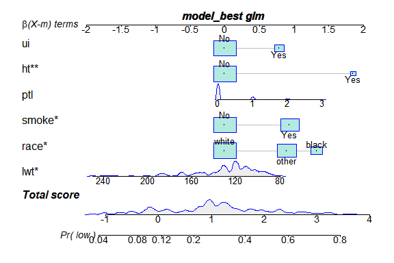

# 统计基础


## 随机抽样与概率分布

### 随机抽样

R 语言内置的随机抽样函数： sample(vector,n,replace=T)。 其中vector为要抽样的总体，这里必须是向量， n为抽取的样本数，replace代表是否为有放回抽样，如果 replace=T, 则代表抽样是有放回的。


```r
# 例如, 下面表示在 1 到 10 间进行 4 次有放回的抽样。
sample(1:10,4,replace=T)
```

```
## [1] 3 1 5 2
```

注意，上面 1 到 10 十个元素中，每个元素被抽取的概率都是相同的，如果需要对概率不同的事件进行模拟，还需要再增加 prob=c()参数。例如，某药物治疗某病成功的治愈的概率为0.3，稳定的概率为 0.6，恶化的概率为0.1，那对50 人进行治疗，疾病治愈、稳定、恶化的模拟如下：


```r
sample(c(" 治愈"," 稳定"," 恶化"),50,replace = T,prob=c(0.3,0.6,0.1))
```

```
##  [1] " 恶化" " 稳定" " 稳定" " 稳定" " 治愈" " 稳定"
##  [7] " 稳定" " 治愈" " 稳定" " 稳定" " 稳定" " 恶化"
## [13] " 治愈" " 稳定" " 稳定" " 稳定" " 稳定" " 稳定"
## [19] " 稳定" " 稳定" " 治愈" " 稳定" " 稳定" " 稳定"
## [25] " 治愈" " 恶化" " 稳定" " 稳定" " 稳定" " 稳定"
## [31] " 稳定" " 稳定" " 治愈" " 稳定" " 治愈" " 稳定"
## [37] " 治愈" " 治愈" " 恶化" " 稳定" " 治愈" " 稳定"
## [43] " 稳定" " 治愈" " 治愈" " 稳定" " 治愈" " 稳定"
## [49] " 稳定" " 治愈"
```

### 常见概率分布

常见概率分布如伯努利分布，二项分布，多项分布，正态分布， t 分布，泊松分布等可以自行理解。

## t检验与多元线性回归分析

t 检验可以用于独立样本，两独立样本，配对样本均值的比较；使用 t 检验的前提是数据满足正态性（如果是两独立样本，则需要满足方差齐性）。

R 语言做 t 检验的函数为 stats 包的 t.test() 函数，我们查看一下这个函数 的帮助，看看里面有什么参数：


```r
?t.test
```

帮助文件中， t.test 的用法是这样描述的：


这里 t.test() 函数有两种用法，一种是 Default S3 method, 另外一种是 S3 method for class "formula"。

-   Default method:


```r
# 比较男女性别身高的差异.
male <- rnorm(100,mean = 178,sd=13)
female <- rnorm(100,mean=168,sd=12)
t.test(male,female,
       alternative="two.side")
```

```
## 
## 	Welch Two Sample t-test
## 
## data:  male and female
## t = 5, df = 194, p-value = 1e-06
## alternative hypothesis: true difference in means is not equal to 0
## 95 percent confidence interval:
##   4.702 10.738
## sample estimates:
## mean of x mean of y 
##     177.9     170.1
```

-   method for class "formula"(R 语言的公式： y\~x):


```r
# 同样男女身高数据，生成 data.frame
sex <- c(rep("male",100),rep("female",100))
height <- c(male,female)
df <- data.frame(sex=sex,
                 height=height)
t.test(height~sex,
       alternative="two.side",
       data=df)
```

```
## 
## 	Welch Two Sample t-test
## 
## data:  height by sex
## t = -5, df = 194, p-value = 1e-06
## alternative hypothesis: true difference in means between group female and group male is not equal to 0
## 95 percent confidence interval:
##  -10.738  -4.702
## sample estimates:
## mean in group female   mean in group male 
##                170.1                177.9
```

但是在 t 检验之前，我们还需要判断两组数据是否满足正态性，方差齐两个条件。

-   正态性检验，使用shapiro.test()函数


```r
# H0：数据满足正态， H1：数据不满足正态
shapiro.test(male)
```

```
## 
## 	Shapiro-Wilk normality test
## 
## data:  male
## W = 0.99, p-value = 0.4
```

```r
shapiro.test(female)
```

```
## 
## 	Shapiro-Wilk normality test
## 
## data:  female
## W = 0.98, p-value = 0.09
```


```r
# H0: 方差齐； H1: 方差不齐
library(car)
leveneTest(height~sex,data=df)
```

```
## Levene's Test for Homogeneity of Variance (center = median)
##        Df F value Pr(>F)
## group   1     2.6   0.11
##       198
```

所以两独立样本 t 检验的完整流程是怎么样子的：


```r
# 1. 正态性检验：
shapiro.test(male)
shapiro.test(female)
# 2. 方差齐性检验；
leveneTest(height~sex,data=df)
# 3.t 检验
t.test(height~sex, # 输入公式
       alternative="two.side",# 双侧检验
       var.equal=T, # 方差齐
       data=df) # 提供数据
```

t 检验非常常见，但是高分文献中，除了非常严格遵循盲法、随机、对照原则的临床实验以外，以它作为主要统计方法，非常罕见，为什么？

主要原因包括：

1.t 检验（或者卡方等其他类型的检验）没有办法获得危险因素的效应值，比如这里，我们不能直观地看到性别对身高的效应值是多少；

2\. 没有办法矫正混杂

我们通过 ToothGrowth 数据，看看混杂因素是怎么影响 t 检验的结果的。

加载并查看数据：


```r
data("ToothGrowth")
str(ToothGrowth)
```

```
## 'data.frame':	60 obs. of  3 variables:
##  $ len : num  4.2 11.5 7.3 5.8 6.4 10 11.2 11.2 5.2 7 ...
##  $ supp: Factor w/ 2 levels "OJ","VC": 2 2 2 2 2 2 2 2 2 2 ...
##  $ dose: num  0.5 0.5 0.5 0.5 0.5 0.5 0.5 0.5 0.5 0.5 ...
```

我们对不同辅食类型小鼠牙齿的长度进行比较：

首先比较总体：


```r
# 总体
t.test(len~supp,
       var.equal=T,
       data=ToothGrowth)
```

```
## 
## 	Two Sample t-test
## 
## data:  len by supp
## t = 1.9, df = 58, p-value = 0.06
## alternative hypothesis: true difference in means between group OJ and group VC is not equal to 0
## 95 percent confidence interval:
##  -0.167  7.567
## sample estimates:
## mean in group OJ mean in group VC 
##            20.66            16.96
```

我们看到总体似乎是没有差异的，因为 p\>0.05。但是除了辅食的不同，剂量也是非常重要的因素，我们按照剂量进行分层，分别进行不同剂量两种辅食的比较：

0.5mg 组：


```r
df <- ToothGrowth |>
    filter(dose==0.5)

t.test(len~supp,
       var.equal=T,
       data=df)
```

```
## 
## 	Two Sample t-test
## 
## data:  len by supp
## t = 3.2, df = 18, p-value = 0.005
## alternative hypothesis: true difference in means between group OJ and group VC is not equal to 0
## 95 percent confidence interval:
##  1.77 8.73
## sample estimates:
## mean in group OJ mean in group VC 
##            13.23             7.98
```

1.0mg 组：


```r
df <- ToothGrowth |> 
    filter(dose == 1.0)

t.test(len~supp,
       var.equal=T,
       data=df)
```

```
## 
## 	Two Sample t-test
## 
## data:  len by supp
## t = 4, df = 18, p-value = 8e-04
## alternative hypothesis: true difference in means between group OJ and group VC is not equal to 0
## 95 percent confidence interval:
##  2.841 9.019
## sample estimates:
## mean in group OJ mean in group VC 
##            22.70            16.77
```

2.0mg 组：


```r
df <- ToothGrowth |> 
    filter(dose == 2.0)

t.test(len~supp,
       var.equal=T,
       data=df)
```

```
## 
## 	Two Sample t-test
## 
## data:  len by supp
## t = -0.046, df = 18, p-value = 1
## alternative hypothesis: true difference in means between group OJ and group VC is not equal to 0
## 95 percent confidence interval:
##  -3.723  3.563
## sample estimates:
## mean in group OJ mean in group VC 
##            26.06            26.14
```

我们进行线性回归，将两个因素同时纳入模型：


```r
# 将剂量转变为 factor
ToothGrowth$dose <- factor(ToothGrowth$dose,
                           levels = c(0.5,1.0,2.0),
                           labels = c("0.5mg","1.0mg","2.0mg"))
# 构建线性模型
fit <- lm(len~supp+dose,
          data=ToothGrowth)
summary(fit)
```

```
## 
## Call:
## lm(formula = len ~ supp + dose, data = ToothGrowth)
## 
## Residuals:
##    Min     1Q Median     3Q    Max 
##  -7.08  -2.75  -0.80   2.45   9.65 
## 
## Coefficients:
##             Estimate Std. Error t value Pr(>|t|)    
## (Intercept)   12.455      0.988   12.60  < 2e-16 ***
## suppVC        -3.700      0.988   -3.74  0.00043 ***
## dose1.0mg      9.130      1.210    7.54  4.4e-10 ***
## dose2.0mg     15.495      1.210   12.80  < 2e-16 ***
## ---
## Signif. codes:  
## 0 '***' 0.001 '**' 0.01 '*' 0.05 '.' 0.1 ' ' 1
## 
## Residual standard error: 3.83 on 56 degrees of freedom
## Multiple R-squared:  0.762,	Adjusted R-squared:  0.75 
## F-statistic: 59.9 on 3 and 56 DF,  p-value: <2e-16
```

提取模型的估计结果：

-   提取系数cofficients


```r
coef1 <- fit$coefficients
coef2 <- fit[1]
coef3 <- coef(fit)
coef
```

```
## function (object, ...) 
## UseMethod("coef")
## <bytecode: 0x00000273e7703278>
## <environment: namespace:stats>
```

提取系数的 95% 可信区间：


```r
interval <- confint(fit)
interval
```

```
##              2.5 % 97.5 %
## (Intercept) 10.475  14.43
## suppVC      -5.680  -1.72
## dose1.0mg    6.705  11.55
## dose2.0mg   13.070  17.92
```

## logistic回归

### 数据来源

我们使用 MASS 包的 birthwt 数据作演示。 birthwt 数据是 1986 年在马萨诸塞州斯普林菲尔德 Baystate 医疗中心收集的，这个数据包括以下几个指标： low: 出生体重小于 2.5 公斤的指标, 如果小于 2.5 则为 1，反之则为 0；

age: 母亲生育时的年龄；

lwt: 母亲在最后一次月经时的体重 (磅);

race: 母亲的种族（1 = 白人， 2 = 黑人， 3 = 其他） ;

smoke: 怀孕期间的吸烟状况;

ptl: 既往早产的次数;

ht：是否有高血压病史;

ui：是否存在子宫刺激;

ftv: 在怀孕的前三个月, 医生看病的次数;

bwt: 出生体重, 以克计。

### 获得并查看数据


```r
library(MASS)

data("birthwt")

str(birthwt)
```

```
## 'data.frame':	189 obs. of  10 variables:
##  $ low  : int  0 0 0 0 0 0 0 0 0 0 ...
##  $ age  : int  19 33 20 21 18 21 22 17 29 26 ...
##  $ lwt  : int  182 155 105 108 107 124 118 103 123 113 ...
##  $ race : int  2 3 1 1 1 3 1 3 1 1 ...
##  $ smoke: int  0 0 1 1 1 0 0 0 1 1 ...
##  $ ptl  : int  0 0 0 0 0 0 0 0 0 0 ...
##  $ ht   : int  0 0 0 0 0 0 0 0 0 0 ...
##  $ ui   : int  1 0 0 1 1 0 0 0 0 0 ...
##  $ ftv  : int  0 3 1 2 0 0 1 1 1 0 ...
##  $ bwt  : int  2523 2551 2557 2594 2600 2622 2637 2637 2663 2665 ...
```

```r
unique(birthwt$low)
```

```
## [1] 0 1
```

### 清洗数据

这里主要是对分类变量进行转换，转换为 factor。


```r
df <- birthwt
df$low <- factor(df$low, 
                 levels = c(0,1),
                 labels = c("No", "Yes"))

df$race <- factor(df$race,
                  levels = c(1,2,3),
                  labels = c("white","black","other"))

df$smoke <- factor(df$smoke,
                   levels = c(0,1),
                   labels = c("No","Yes"))

df$ht <- factor(df$ht,
                levels = c(0,1),
                labels = c("No","Yes"))

df$ui <- factor(df$ui,
                levels = c(0,1),
                labels = c("No","Yes"))
```

### 构建全模型


```r
a <- colnames(df)
a
```

```
##  [1] "low"   "age"   "lwt"   "race"  "smoke" "ptl"  
##  [7] "ht"    "ui"    "ftv"   "bwt"
```

```r
# fix(a)
```


```r
model <- glm(low~age+lwt+race+smoke+ptl+ht+ui+ftv,
             family = binomial(link = "logit"),# 连接函数
             data = df)
summary(model)
```

```
## 
## Call:
## glm(formula = low ~ age + lwt + race + smoke + ptl + ht + ui + 
##     ftv, family = binomial(link = "logit"), data = df)
## 
## Deviance Residuals: 
##    Min      1Q  Median      3Q     Max  
## -1.895  -0.821  -0.532   0.982   2.212  
## 
## Coefficients:
##             Estimate Std. Error z value Pr(>|z|)   
## (Intercept)  0.48062    1.19689    0.40   0.6880   
## age         -0.02955    0.03703   -0.80   0.4249   
## lwt         -0.01542    0.00692   -2.23   0.0258 * 
## raceblack    1.27226    0.52736    2.41   0.0158 * 
## raceother    0.88050    0.44078    2.00   0.0458 * 
## smokeYes     0.93885    0.40215    2.33   0.0196 * 
## ptl          0.54334    0.34540    1.57   0.1157   
## htYes        1.86330    0.69753    2.67   0.0076 **
## uiYes        0.76765    0.45932    1.67   0.0947 . 
## ftv          0.06530    0.17239    0.38   0.7048   
## ---
## Signif. codes:  
## 0 '***' 0.001 '**' 0.01 '*' 0.05 '.' 0.1 ' ' 1
## 
## (Dispersion parameter for binomial family taken to be 1)
## 
##     Null deviance: 234.67  on 188  degrees of freedom
## Residual deviance: 201.28  on 179  degrees of freedom
## AIC: 221.3
## 
## Number of Fisher Scoring iterations: 4
```

### 使用逐步后退法获得最优模型（AIC信息量准则）


```r
step(model)
```

```
## Start:  AIC=221.3
## low ~ age + lwt + race + smoke + ptl + ht + ui + ftv
## 
##         Df Deviance AIC
## - ftv    1      201 219
## - age    1      202 220
## <none>          201 221
## - ptl    1      204 222
## - ui     1      204 222
## - race   2      209 225
## - lwt    1      207 225
## - smoke  1      207 225
## - ht     1      209 227
## 
## Step:  AIC=219.4
## low ~ age + lwt + race + smoke + ptl + ht + ui
## 
##         Df Deviance AIC
## - age    1      202 218
## <none>          201 219
## - ptl    1      204 220
## - ui     1      204 220
## - race   2      209 223
## - lwt    1      207 223
## - smoke  1      207 223
## - ht     1      209 225
## 
## Step:  AIC=218
## low ~ lwt + race + smoke + ptl + ht + ui
## 
##         Df Deviance AIC
## <none>          202 218
## - ptl    1      204 218
## - ui     1      205 219
## - smoke  1      208 222
## - lwt    1      208 222
## - race   2      210 222
## - ht     1      210 224
```

```
## 
## Call:  glm(formula = low ~ lwt + race + smoke + ptl + ht + ui, family = binomial(link = "logit"), 
##     data = df)
## 
## Coefficients:
## (Intercept)          lwt    raceblack    raceother  
##     -0.0865      -0.0159       1.3257       0.8971  
##    smokeYes          ptl        htYes        uiYes  
##      0.9387       0.5032       1.8550       0.7857  
## 
## Degrees of Freedom: 188 Total (i.e. Null);  181 Residual
## Null Deviance:	    235 
## Residual Deviance: 202 	AIC: 218
```

### 最优模型


```r
model_best <- glm(formula = low ~ lwt + race + smoke + ptl + ht + ui,
                  family = binomial(link = "logit"),
                  data = df)
summary(model_best)
```

```
## 
## Call:
## glm(formula = low ~ lwt + race + smoke + ptl + ht + ui, family = binomial(link = "logit"), 
##     data = df)
## 
## Deviance Residuals: 
##    Min      1Q  Median      3Q     Max  
## -1.905  -0.812  -0.524   0.948   2.181  
## 
## Coefficients:
##             Estimate Std. Error z value Pr(>|z|)   
## (Intercept) -0.08655    0.95176   -0.09   0.9275   
## lwt         -0.01591    0.00686   -2.32   0.0203 * 
## raceblack    1.32572    0.52224    2.54   0.0111 * 
## raceother    0.89708    0.43388    2.07   0.0387 * 
## smokeYes     0.93873    0.39872    2.35   0.0186 * 
## ptl          0.50321    0.34123    1.47   0.1403   
## htYes        1.85504    0.69512    2.67   0.0076 **
## uiYes        0.78570    0.45644    1.72   0.0852 . 
## ---
## Signif. codes:  
## 0 '***' 0.001 '**' 0.01 '*' 0.05 '.' 0.1 ' ' 1
## 
## (Dispersion parameter for binomial family taken to be 1)
## 
##     Null deviance: 234.67  on 188  degrees of freedom
## Residual deviance: 201.99  on 181  degrees of freedom
## AIC: 218
## 
## Number of Fisher Scoring iterations: 4
```

### 提取系数的OR值与区间，并写出


```r
# 提取 OR 与区间并合并
or <- exp(coef(model_best))# 系数
or_interval <- exp(confint(model_best))
or <- cbind(or,or_interval)
# 提取其他值
temp <- summary(model_best)
temp <- temp$coefficients
# 合并
results <- cbind(temp,or)
# write.csv(results,"results.csv",row.names = T)
```

### 随手画一个列线图


```r
# install.packages("regplot")
library(regplot)
regplot(model_best)
```



## 本章作业

1. 抛硬币，假设硬币两面密度不均， A 面向上的概率为 0.55， B 面向上的概率为 0.45，连续抛 50 次，模拟每次抛硬币的结果。


```r
sample(c("正面","反面"),
       50,
       replace = T,
       prob=c(0.55,0.45))
```

```
##  [1] "正面" "反面" "正面" "正面" "正面" "正面" "反面"
##  [8] "反面" "正面" "反面" "正面" "反面" "正面" "反面"
## [15] "反面" "反面" "正面" "正面" "反面" "正面" "正面"
## [22] "正面" "正面" "正面" "反面" "反面" "反面" "正面"
## [29] "正面" "正面" "正面" "正面" "正面" "反面" "正面"
## [36] "正面" "正面" "反面" "反面" "正面" "反面" "反面"
## [43] "反面" "反面" "正面" "正面" "反面" "反面" "正面"
## [50] "反面"
```

2. 使用 ToothGrowth 数据，将牙齿生长长度按照 18.8 分为两类，如果大于18.8 定义为阳性，否则定义为阴性，使用 logistic 回归分析辅食类型与剂量对阳性事件的影响。（提取 OR 等并且写出哦！）


```r
rm(list=ls())
library(tidyverse)
data("ToothGrowth")
str(ToothGrowth)
```

```
## 'data.frame':	60 obs. of  3 variables:
##  $ len : num  4.2 11.5 7.3 5.8 6.4 10 11.2 11.2 5.2 7 ...
##  $ supp: Factor w/ 2 levels "OJ","VC": 2 2 2 2 2 2 2 2 2 2 ...
##  $ dose: num  0.5 0.5 0.5 0.5 0.5 0.5 0.5 0.5 0.5 0.5 ...
```

```r
colnames(ToothGrowth)
```

```
## [1] "len"  "supp" "dose"
```

```r
df <- ToothGrowth |> 
  mutate(len2=ifelse(len>18.8,"阳性","阴性"))
df$len2 <- factor(df$len2,
                  levels = c("阴性","阳性"),
                  labels = c("阴性","阳性"))
# logistic
fit <- glm(len2~supp+dose,
    family = binomial(link = "logit"),
    data=df)
temp <- summary(fit)
temp <- temp$coefficients

OR <- exp(coef(fit))
OR_interval <- exp(confint(fit))
OR <- cbind(OR,OR_interval)
result <- cbind(temp,OR)
getwd()
```

```
## [1] "D:/OneDrive - b.sxmu.edu.cn/03-yh学习/00-小论文/03-GBD/GBD_yh_test"
```

```r
# write.csv(result,"logistic.csv",row.names = T)
```

3. 课后思考题：辅食类型与剂量是否存在交互效应？分别研究交互效应对len(线性模型) 与阳性事件（logistic 回归）的影响。


```r
fit1 <- glm(len2~supp+dose+supp:dose, #写法1
           family = binomial(link = "logit"),
           data=df)
fit2 <- glm(len2~supp*dose, #写法2
            family = binomial(link = "logit"),
            data=df)

fit3 <- glm(len2~(supp+dose)^2, #写法3
            family = binomial(link = "logit"),
            data=df)

# 交互效应的解读
summary(fit3)
```

```
## 
## Call:
## glm(formula = len2 ~ (supp + dose)^2, family = binomial(link = "logit"), 
##     data = df)
## 
## Deviance Residuals: 
##     Min       1Q   Median       3Q      Max  
## -2.1680  -0.4242  -0.0654   0.4477   2.2148  
## 
## Coefficients:
##             Estimate Std. Error z value Pr(>|z|)   
## (Intercept)   -6.593      2.355   -2.80   0.0051 **
## suppVC        -0.382      3.227   -0.12   0.9057   
## dose           8.791      2.978    2.95   0.0032 **
## suppVC:dose   -4.178      3.296   -1.27   0.2049   
## ---
## Signif. codes:  
## 0 '***' 0.001 '**' 0.01 '*' 0.05 '.' 0.1 ' ' 1
## 
## (Dispersion parameter for binomial family taken to be 1)
## 
##     Null deviance: 83.178  on 59  degrees of freedom
## Residual deviance: 26.220  on 56  degrees of freedom
## AIC: 34.22
## 
## Number of Fisher Scoring iterations: 7
```

```r
# 1.看主效应：看主效应方向；主效应的方向代表这个向量对结局的影响；
# 2.看交互效应的方向：交互效应的方向代表了另外一个变量对该变量对结局影响的削弱或者增强。
# 3.一般只做两个变量的交互，没必要做更高阶的交互。
# 4.交互效应有没有必要放入模型？看P值；看AIC。
# anova(fit,fit3)
AIC(fit,fit3)
```

```
##      df   AIC
## fit   3 34.04
## fit3  4 34.22
```
