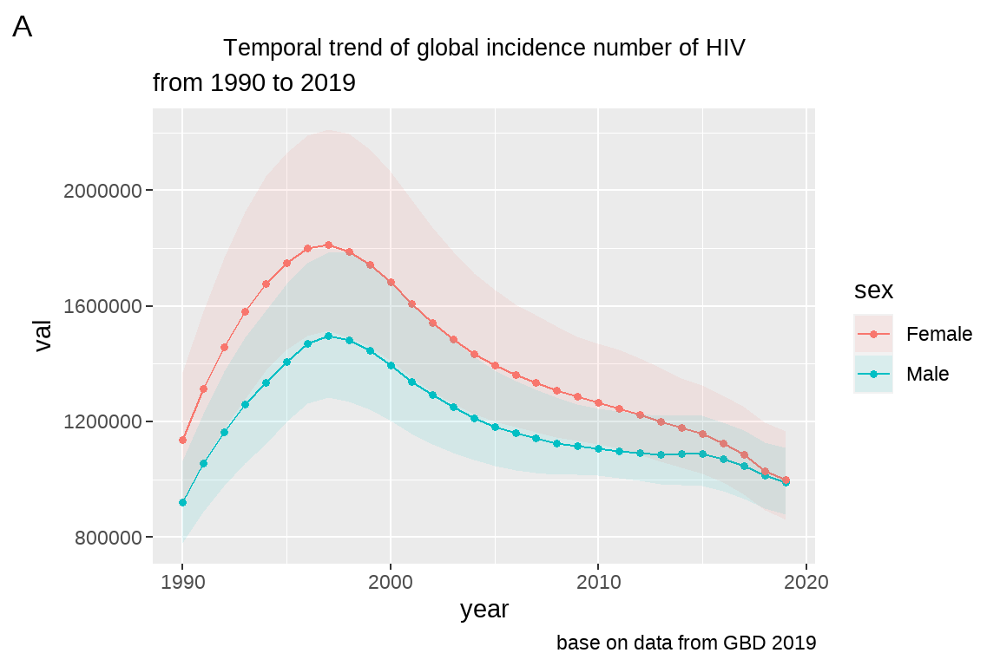
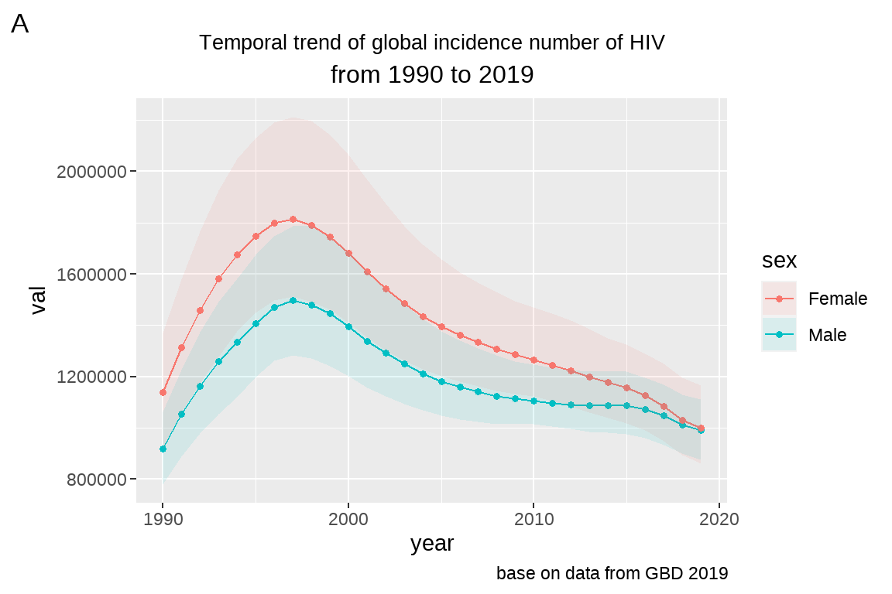
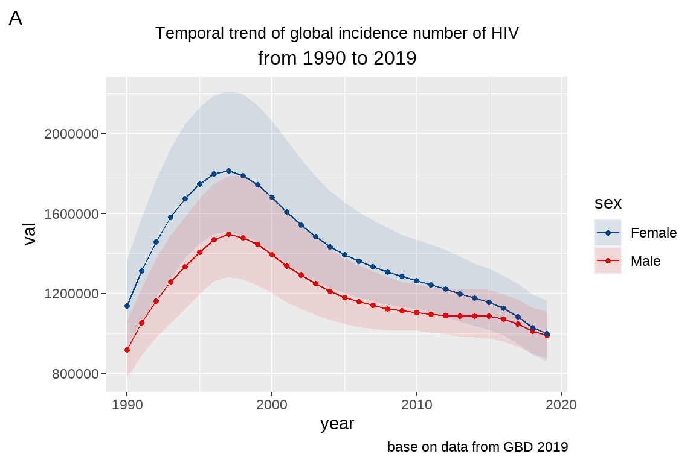
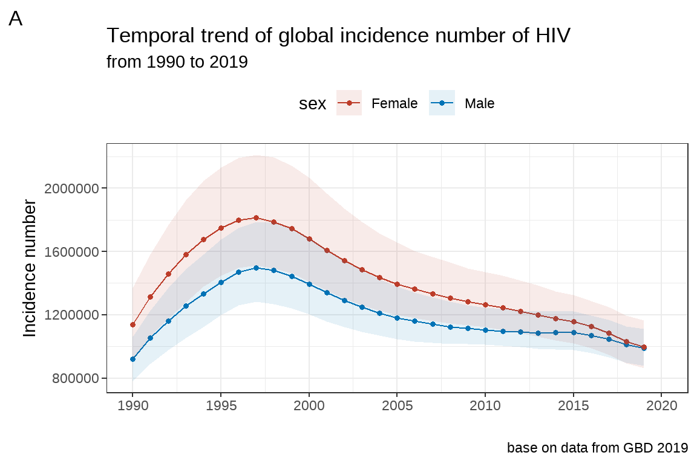
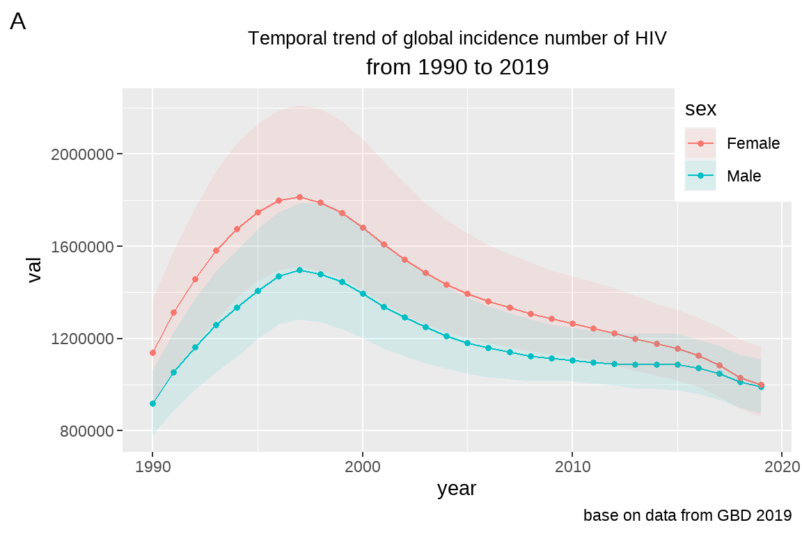
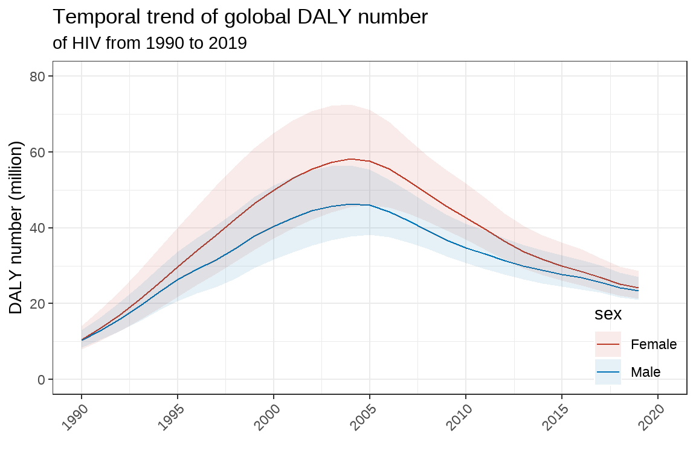

# ggplot图层语法与GBD数据展示一


## 图层的基本概念

ggplot2 图层语法，可以类比于 photoshop 中图层的概念：


ggplot2 绘制的图形，也是由一个个图层叠加而成的。

每一个图层，都可以指定用于画图的数据，指定需要绘制的几何图案，以及图像的美学属性映射，包括颜色、坐标、位置、尺度等等；图层代码与图层 代码之间，则用加号"+"进行连接。

图层语法模板


```r
# 加载 ggplot2 包
library(ggplot2)
# 打开画板
ggplot(data=df1, # 指定数据
       aes(x=x1,y=y1,color=group1))+ # 美学属性映射
    # 图层 1
    geom_point()+
    # 图层 2
    geom_line(data=df2,aes(x=x2,y=y2,color=group2))+ 
    # 其他
    scale_y_continues()+ # 尺度设定
    facet_wrap()+ # 分面
    theme() # 主题风格设定
```

## ggplot2 基本元素

### 数据

画图第一件事，肯定是指定用于画图的数据。一般用于 ggplot2 画图的数据，是长数据 (整洁的数据)。

### 几何图形

统计图中最常见的几种几何图案：点、线、柱状图、条形图、直方图、误差图、箱图......

ggplot2 用 geometry 函数指定所需绘制的图案，比如 geom_point(),geom_line(),geom_bar(),geom_errorb

geom 是 geometry 的前四个字母， geom\_ 下划线后连接几何图形比如point,bar,box 等。 geometry 函数可以设定不同的参数，包括坐标，位置，颜色，尺度等。

### 美学属性映射

美学的英文单词： aesthetic。 aes() 函数将某个变量的数据映射给某种美学属性。美学属性可以在画板处进行全局映射，也可以在某个图层中进行局部映射。


```r
# 打开画板
ggplot(data=df1,
aes(x=x1,y=y1,color=group1))+ # 全局映射
    # 图层 1
    geom_point()+ # 受全局映射的控制
    # 图层 2
    geom_line(data=df2,aes(x=x2,y=y2,group=group2))+ #局部映射不受控制
    # 其他
    scale_y_continues()+
    facet_wrap()+
    theme()
```

## 我的第一个图

这里我们用 Global_HIV.csv 数据进行第一个图的绘制：

使用线图展示 **1990 到 2019** 年全球**男**、**女** **HIV 发病人数**的变化趋势。

### 准备画图数据

-   加载需要的R包


```r
library(ggplot2)
library(tidyverse)
```

-   读取数据


```r
df <- read_csv("data/Global_HIV.csv")
```

-   查看数据


```r
colnames(df)
```

```
##  [1] "measure"  "location" "sex"      "age"     
##  [5] "cause"    "metric"   "year"     "val"     
##  [9] "upper"    "lower"
```

```r
unique(df$measure)
```

```
## [1] "Deaths"                                
## [2] "YLLs (Years of Life Lost)"             
## [3] "Incidence"                             
## [4] "DALYs (Disability-Adjusted Life Years)"
## [5] "YLDs (Years Lived with Disability)"    
## [6] "Prevalence"
```

```r
unique(df$sex)
```

```
## [1] "Male"   "Female" "Both"
```

```r
unique(df$age)
```

```
##  [1] "<5 years"         "5-9 years"       
##  [3] "10-14 years"      "15-19 years"     
##  [5] "20-24 years"      "25-29 years"     
##  [7] "30-34 years"      "35-39 years"     
##  [9] "40-44 years"      "45-49 years"     
## [11] "50-54 years"      "55-59 years"     
## [13] "60-64 years"      "65-69 years"     
## [15] "70-74 years"      "75-79 years"     
## [17] "All ages"         "Age-standardized"
## [19] "80-84 years"      "85-89 years"     
## [21] "90-94 years"      "95+ years"
```

```r
unique(df$cause)
```

```
## [1] "HIV/AIDS and sexually transmitted infections" 
## [2] "HIV/AIDS"                                     
## [3] "Sexually transmitted infections excluding HIV"
## [4] "Syphilis"                                     
## [5] "Chlamydial infection"                         
## [6] "Gonococcal infection"                         
## [7] "Other sexually transmitted infections"        
## [8] "Trichomoniasis"                               
## [9] "Genital herpes"
```

```r
unique(df$metric)
```

```
## [1] "Number"  "Percent" "Rate"
```

-   选择数据


```r
temp <- df |>
    filter(measure=="Incidence") |>
    filter(sex%in%c("Male","Female")) |>
    filter(age=="All ages") |>
    filter(cause=="HIV/AIDS") |>
    filter(metric=="Number")
str(temp)
```

```
## spc_tbl_ [60 × 10] (S3: spec_tbl_df/tbl_df/tbl/data.frame)
##  $ measure : chr [1:60] "Incidence" "Incidence" "Incidence" "Incidence" ...
##  $ location: chr [1:60] "Global" "Global" "Global" "Global" ...
##  $ sex     : chr [1:60] "Male" "Female" "Male" "Female" ...
##  $ age     : chr [1:60] "All ages" "All ages" "All ages" "All ages" ...
##  $ cause   : chr [1:60] "HIV/AIDS" "HIV/AIDS" "HIV/AIDS" "HIV/AIDS" ...
##  $ metric  : chr [1:60] "Number" "Number" "Number" "Number" ...
##  $ year    : num [1:60] 1991 1991 1990 1990 1994 ...
##  $ val     : num [1:60] 1054341 1313369 919820 1137890 1334822 ...
##  $ upper   : num [1:60] 1226338 1579485 1063665 1371008 1582749 ...
##  $ lower   : num [1:60] 888662 1060693 780544 916513 1121995 ...
##  - attr(*, "spec")=
##   .. cols(
##   ..   measure = col_character(),
##   ..   location = col_character(),
##   ..   sex = col_character(),
##   ..   age = col_character(),
##   ..   cause = col_character(),
##   ..   metric = col_character(),
##   ..   year = col_double(),
##   ..   val = col_double(),
##   ..   upper = col_double(),
##   ..   lower = col_double()
##   .. )
##  - attr(*, "problems")=<externalptr>
```

### 画图

思考：我们想直观地对比男性、女性 HIV 发病人数发展变化趋势，需要将两条线放在同一个图案中，该怎么做？

方法：使用不同的颜色进行区分。用 ggplot2 美学属性映射的思维，就是将性别这个变量映射到颜色中去。


```r
fig1 <- ggplot(data = temp,aes(x=year,y=val,color=sex))+
    geom_line()
fig1
```


### 如何查看 ggplot2 内部函数参数的种类及作用？


```r
?ggplot
?aes
?geom_line
```

### 图片的保存

两种保存图片的方式：

1、使用 export 导出 (不推荐)；【直接再窗口保存，不推荐】

2、使用 ggsave() 函数导出：


```r
ggsave(" 我的第一个图.jpeg",width = 8,height = 6,dpi = 300)
```

### 作业一

1.  给 fig1 增加一个点图层，点为各个年份的发病人数，将每个点的大小设定为 1.2(size=1.2)，并将生成的图片对象赋值给 fig2。


```r
fig2 <- ggplot(data = temp,aes(x=year,y=val,color=sex))+
    geom_line()+
    geom_point(size= 1.2)
fig2
```


2.  给 fig2 增加一个图层, 展示发病人数的 95%UI, 提示：geom_ribbon(aes(ymin=?,ymax=?)), 将 95%UI 的填充颜色按照性别区分（提示：将性别这个变量映射到填充颜色中去，设置 fill=?）；并将填充颜色的透明度设置为 0.1（alpha=?）。最终将生成的图片对象赋值给 fig3.


```r
# fig3 <- ggplot(data = temp,aes(x=year,y=val,color=sex))+
#     geom_line()+
#     geom_point(size= 1.2)+
#     geom_ribbon(aes(ymin=lower,ymax=upper,fill=sex),alpha=0.1)
# fig3

# 或者
fig3 <- fig2 + geom_ribbon(aes(ymin = lower, ymax = upper, fill = sex), 
                           alpha = 0.1)
fig3
```


3.  去除 fig3 图片中 95%UI 的颜色边框（提示：设置 color=NA），并大胆猜测 fill 和 color 参数的作用范围。然后赋值给 fig4。


```r
fig4 <- ggplot(data = temp,aes(x=year,y=val,color=sex))+
    geom_line()+
    geom_point(size= 1.2)+
    geom_ribbon(aes(ymin=lower,ymax=upper,fill=sex),alpha=0.1,color=NA)
fig4
```


4.  使用线图展示全球因艾滋病死亡人数的发展变化趋势，并用 ggsave 函数保存到工作路径中。


```r
fig5 <- ggplot(data = df,aes(x=year,y=val,color=sex))+
    geom_line()
    
fig5
```


```r
# ggsave(filename = "AIDs线图.jpeg",width = 8,height = 6,dpi = 300)
```

## 图片的标题与注脚

### 增加标题、副标题、注脚、标签

前面我们生成了 fig4：

现在要在图片上方增加一个图片标题 (title)： Temporal trend of global incidence number of HIV; 副标题 subtitle: from 1990 to 2019; 在图片下方增加

注脚 (caption)： base on data from GBD 2019；最后打上一个"A" 的标签。


```r
fig5 <- fig4 +
    labs(title = "Temporal trend of global incidence number of HIV",
         subtitle = "from 1990 to 2019",
         caption = "base on data from GBD 2019",
         tag="A")
fig5
```


### 修改图片标题的字体大小、位置


```r
fig5 <- fig4 +
    labs(title = "Temporal trend of global incidence number of HIV",
         subtitle = "from 1990 to 2019",
         caption = "base on data from GBD 2019",
         tag="A")+
    theme(plot.title = element_text(size = 10,
                                    hjust = 0.5)) # h表示横向，just表示矫正；vjust表示垂直矫正。 0-->1   左-->右
fig5
```



### 作业二

将 fig5 的图片标题，副标题字体大小均设定为 12，居中显示。


```r
fig5 <- fig4 +
    labs(title = "Temporal trend of global incidence number of HIV",
         subtitle = "from 1990 to 2019",
         caption = "base on data from GBD 2019",
         tag="A")+
    theme(plot.title = element_text(size = 10,
                                    hjust = 0.5)) +# h表示横向，just表示矫正；vjust表示垂直矫正。 0-->1   左-->右
    theme(plot.subtitle = element_text(size = 12,
                                       hjust = 0.5))
fig5
```



## 坐标轴设定

### 坐标轴标题修改

修改 fig5 坐标轴的标题, 将 Y 轴的设为 Incidence number，将 X 轴的标题去掉.


```r
# 方法一：
fig5+
    xlab(label = "")+
    ylab(label="Incidence number")
```


```r
# 方法二：
fig5+
    labs(x="",y="Incidence number")
```


-   坐标轴标题 (title) 字体大小设定

字体大小一般都在 theme 里面设定：


```r
fig5+
    xlab(label = "")+
    ylab(label="Incidence number")+
    theme(axis.title = element_text(size = 6))
```


### 坐标轴尺度、分段、标签设定

将 fig5 的 x 轴限度设置在 1990 年到 2019 年之间，间隔 5 年分段, 并改变每段标签为"year:1990"。


```r
fig5+
    labs(x="", y="Incidence number")+
    scale_x_continuous(limits=c(1990,2020),
                       breaks = seq(1990,2020,by=5),
                       labels = paste("year:",
                                      seq(1990,2020,by=5)))
```


### 坐标轴文字（text）大小、旋转设定

将上图 x 轴文字大小设定为 8，旋转为 45° 排列，同样在 theme 里面设定。


```r
fig5+
    labs(x="", y="Incidence number")+
    scale_x_continuous(limits=c(1990,2020),
                       breaks = seq(1990,2020,by=5),
                       labels = paste("year:",
                                      seq(1990,2020,by=5)))+
    theme(axis.text.x = element_text(size=8,
                                     angle = 45,
                                     hjust=1,
                                     vjust = 1))
```


### 作业三

设定 fig5 的 y 轴，将它的限度设置在 0 到 2.5 million 之间，间隔为 0.5 million，尺度缩小 1 百万倍，同时 y 轴的标题变为 Incidence number(million)


```r
fig5 +
    labs(x="", y="Incidence number")+
    theme(axis.text.x = element_text(size=8,
                                     angle = 45,
                                     hjust=1,
                                     vjust = 1))+
    scale_x_continuous(limits=c(1990,2020),
                       breaks = seq(1990,2020,by=5),
                       labels = paste("year:",
                                      seq(1990,2020,by=5)))+
    scale_y_continuous(limits=c(0,2500000),
                       breaks = seq(0,2500000,by=500000),
                       labels = paste(seq(0,2.5, by = 0.5), "millon")) 
```


## 颜色尺度的调整

### 手工调整颜色

手动调整颜色，将男性颜色设置为蓝色，女性颜色设置为红色

常用颜色代码：＃号后面 6 位数。<https://www.cnblogs.com/biostat-yu/p/13839621.html>


```r
fig5+
    scale_fill_manual(values=c("red","blue"))+
    scale_color_manual(values=c("red","blue"))
```


### 使用 ggsci() 代替 scale_fill/color_manual


```r
# install.packages("ggsci")
library(ggsci)
fig5+
    scale_fill_nejm()+ # 使用新英格兰配色
    scale_color_nejm()
```


```r
fig5+
    scale_fill_lancet()+ # 使用柳叶刀配色
    scale_color_lancet()
```



## 修改主题的其他元素： theme()

前面已经提到，图片的 title, 轴的 title、 text，字体大小等都在 theme 里面设定，这里还可以修改其他元素：

-   常用主题


```r
# theme_bw()
fig7 <- fig5+
    labs(x="", y="Incidence number")+
    scale_x_continuous(limits=c(1990,2020),
                       breaks = seq(1990,2020,by=5),
                       labels = seq(1990,2020,by=5))+
    scale_fill_nejm()+
    scale_color_nejm()+
    theme_bw()
fig7
```


```r
# theme_classic()
fig7+theme_classic()
```


```r
# theme_gray()
fig7+theme_gray()
```


### 图例 legend 的修改

#### legend 可以放在图片的上下左右：


```r
# 没有 legend
fig7+theme(legend.position = "none")# 没有 legend
```


```r
# legend 在上方
fig7+theme(legend.position = "top")
```



**legend 还可以在左边, 下方，右边，相应的参数取值为 legend.position ="left","bottom","right"。**

#### legend 也可以放在图片的内部：


```r
# 比如在左下角：
fig5+theme(legend.position = c(0,1),
           legend.justification=c(0,1))
```


```r
# 比如在右上角：
fig5+theme(legend.position = c(1,1),
           legend.justification=c(1,1))
```



参数设定规则： legend.position = c(0,1) 中 c(0,1) 逗号前面的值设定 legend在 x 轴的相对位置；逗号后面的值设定 legend 在 y 轴的相对位置，另外，legend.justification 设定与 legend.position 一致即可。比如设定 legend 在图片**内左下角，左上角，右上角，右下角分别为 c(0,0),c(0,1),c(1,0),c(1,1)。**

### 作业四

将 fig5 的背景主题设置为 theme_bw()，并将 legend 设置在图片内正中间。


```r
fig5+theme_bw()+
    theme(legend.position = c(0.5,0.5),
           legend.justification=c(0.5,0.5))
```


## 总结

1.  画图之前查看数据；

2.  想好用什么几何图形展示数据：点？线？柱？条？

3.  设定 aes(), 指定 x、 y、 color、 fill 等参数的映射；

4.  映射可通过画板全局设定，也可以在单个图层设定；

5.  图层以 + 号连接；

6.  坐标轴、颜色等尺度可以通过 scale\_ 图层指定；

7.  字体大小、位置、旋转等可以通过 theme 图层设定。

## 课后作业

使用线图展示全球 HIV 的 DALY number 数据，要求：

1.  有图片 title,caption,tag，

2.  x 轴的尺度在 1990-2020 之间，间隔为 5 年， 45° 旋转

3.  不同颜色表示男性、女性；

4.  展示 95%UI，有透明度、边框颜色参数的设定；

5.  设定 legend 位置为图片内，右下角；

6.  使用 ggsave 导出 jpeg 格式， dpi=300。


```r
df <- read_csv("data/Global_HIV.csv")

temp3 <- df |>
  filter(measure=="DALYs (Disability-Adjusted Life Years)") |>
  filter(sex%in%c("Male","Female")) |>
  filter(age=="All ages") |>
  filter(cause=="HIV/AIDS") |>
  filter(metric=="Number")
# 看看最大值有多大
max(temp3$val)
```

```
## [1] 58206725
```

```r
max(temp3$upper) #72,576,395
```

```
## [1] 72576395
```

```r
# 绘图
library(ggsci)
pic <- ggplot(data = temp3,aes(x=year,y=val,color=sex))+
  geom_line()+
  geom_ribbon(aes(ymin=lower,ymax=upper,fill=sex),
              alpha=0.1,
              color=NA)+
  scale_x_continuous(limits = c(1990,2020),
                     breaks = seq(1990,2020,by=5),
                     labels = seq(1990,2020,by=5))+
  scale_y_continuous(limits = c(0,80000000),
                     breaks = seq(0,80000000,by=20000000),
                     labels = seq(0,80,by=20))+
  scale_fill_nejm()+
  scale_color_nejm()+
  labs(title="Temporal trend of golobal DALY number",
       subtitle = "of HIV from 1990 to 2019",
       x="",
       y="DALY number (million)")+
  theme_bw()+
  theme(legend.position = c(1,0),
        legend.justification=c(1,0),
        legend.background  = element_blank(),
        axis.text.x = element_text(angle = 45,hjust = 1,vjust=1))


pic
```


