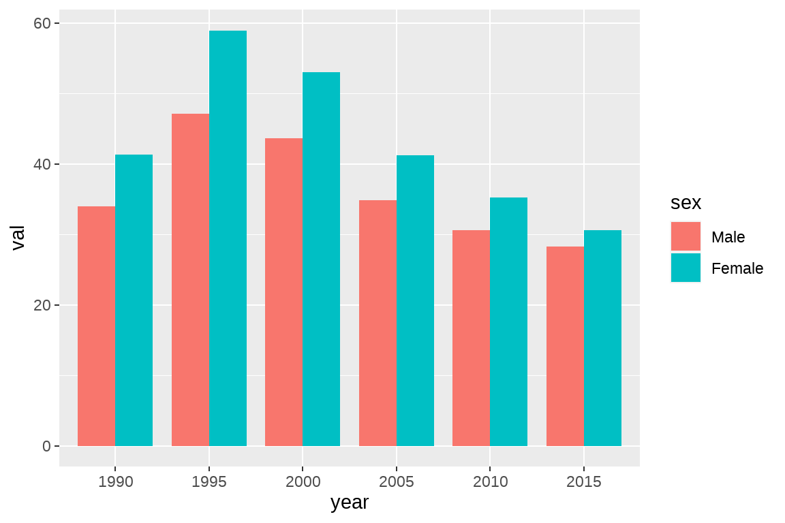

# ggplot2图层语法与GBD数据可视化二


## 柱状图

### geom_col 与 geom_bar 的区别

geom_col 或者 geom_bar是常用的绘制柱状图的方法，它们都是使用柱（条）的高度来展示数据，但是二者存在一些差异：

1. geom_col 必须要映射 x,y 两个参数，如：geom_col(data,aes(x,y))，其中， x 为每个柱（条）的位置， y 展示的每个柱子（条）的具体数值；

2. geom_bar 默认的参数为geom_bar(data,aes(x),stat=“count”)，这时候只能映射一个参数 x，不能设定 y。这里的 stat 是 statistics 的前面四个字母，是统计变换的意思。如果stat=“identity”（识别，不进行变换），则geom_bar 与 geom_col 完全相同


### geom_col/geom_bar 的常用参数

我们展示 GBD 数据时, 一般不需要用到统计变换 stat=“count”, 多数情况下使用 geom_col 或者geom_bar(stat=“identity”)，需要指定 x 与 y 两个参数。

以全球艾滋病年龄标准化发病率为例, 我们想用柱状图展示 1990 年到 2019年 HIV 的年龄标准化患病率（间隔 5 年）：


```r
library(tidyverse)
# 读取数据
df <- read.csv("data/global_HIV.csv",header=T)
# 选择数据并且画图
fig1 <- df |>
    filter(cause=="HIV/AIDS") |>
    filter(sex%in%c("Male","Female")) |>
    filter(measure=="Incidence") |>
    filter(age=="Age-standardized") |>
    filter(metric=="Rate") |>
    filter(year%in%seq(1990,2019,by=5)) |>
    mutate(year=factor(year)) |> # 将年份设置为因子
    mutate(sex=factor(sex,levels = c("Male","Female"))) |>
    ggplot(aes(x=year,y=val,fill=sex))+
    # geom_bar(stat = "identity",position=position_dodge())
    geom_col(position = "dodge",width = 0.8)

fig1
```


这里我们使用管道操作直接将数据筛选后用管道符 “|>” 连接后续的 ggplot() 函数，这样做的好处是可以避免生成多余的变量。这里需要注意的是，管道操作是用管道符”|>” 连接的，而 ggplot() 之后，图层是用”+“进行连接。

#### position

### 课堂作业 1：给柱状图加个误差


## ggplot2 的分面系统


### facet_wrap/facet_grid/facet_nested


### facet_wrap


### facet_grid/facet_nested


## 图形的组合


### 按照行


### 按照列


### 增加图片的其他元素（plot_annotation）


### 增加空格（plot_spacer）


### 通过 layout 控制图片的位置： design=layout


### legend 的调整（收集标签） 


## 课后作业

1. 绘制下面图形。（提示：使用课堂作业相同的数据， coord_flip() 可以翻转 x-y 轴； 1990 的数值设置为负）


2. 绘制下图（提示：使用 patchwork 改写 fig5）


