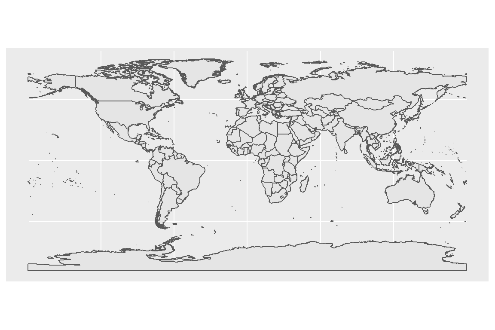
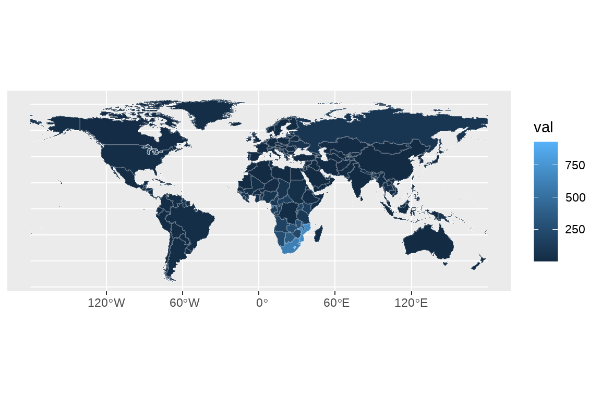
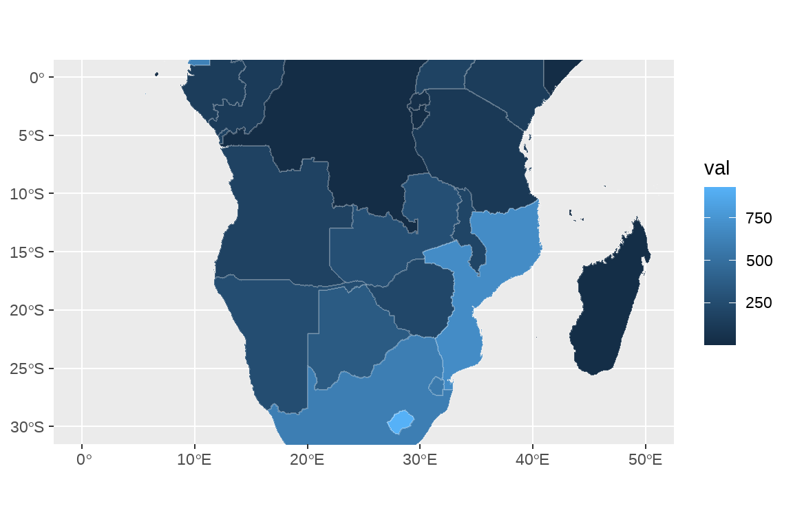
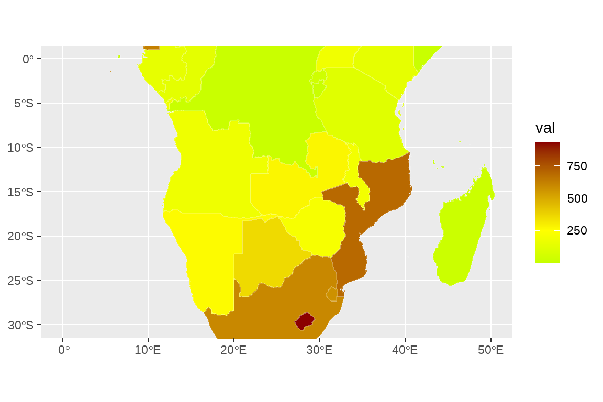
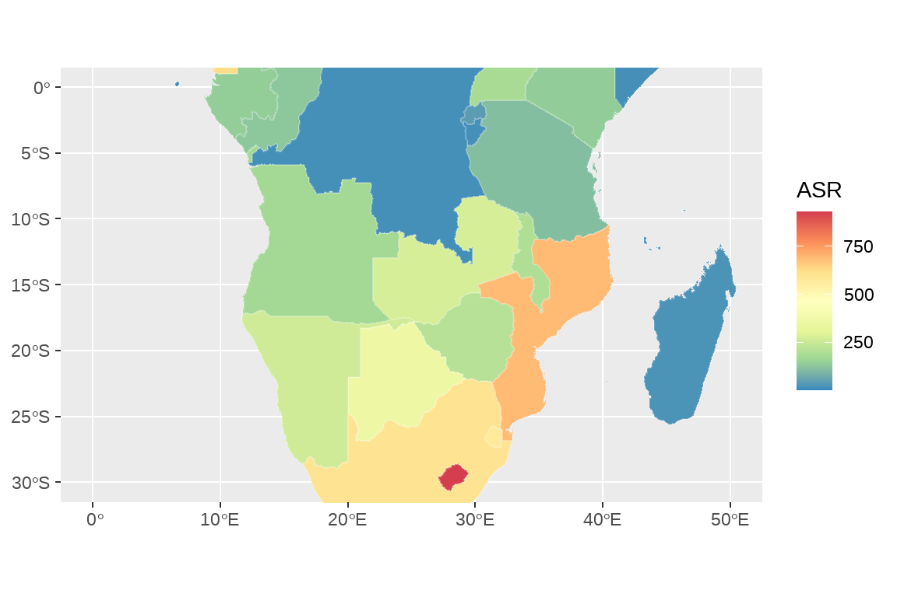
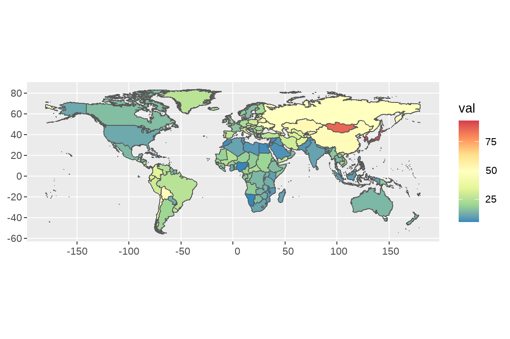
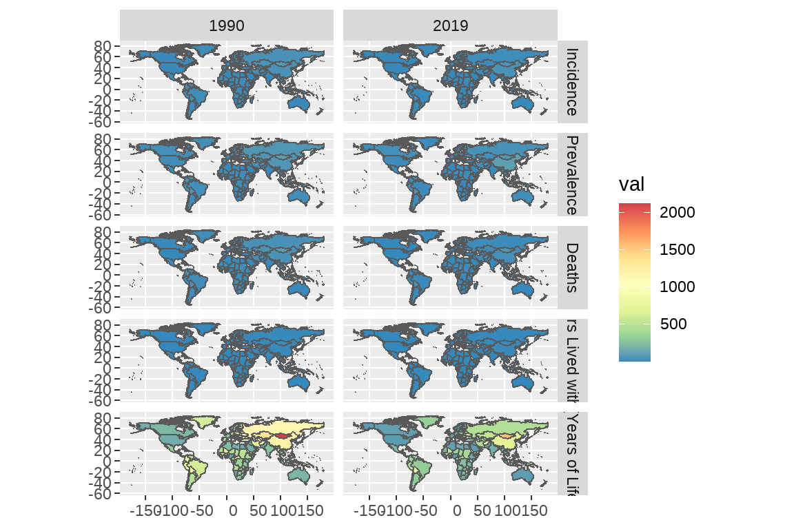

# GBD 数据可视化 -绘制地图


## sf包

### 读取文件


```r
map <- st_read("data/世界国家/世界国家.shp")
```

```
## Reading layer `世界国家' from data source 
##   `D:\OneDrive - b.sxmu.edu.cn\03-yh学习\00-小论文\03-GBD\GBD_yh_test\data\世界国家\世界国家.shp' 
##   using driver `ESRI Shapefile'
## Simple feature collection with 247 features and 10 fields
## Geometry type: MULTIPOLYGON
## Dimension:     XY
## Bounding box:  xmin: -180 ymin: -90 xmax: 180 ymax: 83.63
## CRS:           NA
```

```r
map2 <- read_sf("data/世界国家/世界国家.shp") # 推荐读取方式
class(map)
```

```
## [1] "sf"         "data.frame"
```

```r
class(map2)
```

```
## [1] "sf"         "tbl_df"     "tbl"        "data.frame"
```

### 查看shp文件


```r
colnames(map)
```

```
##  [1] "OBJECTID"   "NAME"       "FENAME"    
##  [4] "FCNAME"     "SOC"        "POP"       
##  [7] "ELEMID"     "SHAPE_LENG" "SHAPE_AREA"
## [10] "ID1"        "geometry"
```

### 设定地图文件的坐标参考系


```r
map <- st_set_crs(map,4326)
```

### 简单绘制世界地图


```r
ggplot(data=map)+
    geom_sf()
```



## 利用 ggplot2 绘制地图

### 读取 GBD 数据


```r
GBD <- read.csv("data/national HIV.csv")
colnames(GBD)
```

```
##  [1] "measure"  "location" "sex"      "age"     
##  [5] "cause"    "metric"   "year"     "val"     
##  [9] "upper"    "lower"
```

### 读取 location 数据

GBD 的国家（或地区）名与地图上的国家（或地区）名并不能完全匹配，因此通过两个数据的地区直接连接会产生大量的 NA 值。 location 数据是我已经整理好的，用于连接 GBD 和地图数据的中间数据。它有三列，分别为 location,location2,location3。其中 location 与 GBD 的 location 完全一致;location2 与 map 数据的 FENAME 列完全一致； location3 与 map 数据的 NAME 列完全一致。


```r
# 读取 location 数据
location <- read.csv("data/location.csv")
colnames(location)
```

```
## [1] "location"  "location2" "location3"
```

我们可以通过这个 location 数据实现 GBD 数据与 map 数据的连接合并。

### 数据的合并联接

tidyverse 包中的 join 函数可以实现两个数据的合并联接。根据目的不同，join 函数可以分为： left_join(),inner_join(),full_join() 等多个函数。它们的具体功能可以参考本次教案 join 函数讲解 ppt。

首先，我们合并 GBD 数据与 location 数据：


```r
GBD <- left_join(GBD,location,by="location")
colnames(GBD)
```

```
##  [1] "measure"   "location"  "sex"       "age"      
##  [5] "cause"     "metric"    "year"      "val"      
##  [9] "upper"     "lower"     "location2" "location3"
```

然后，我们再通过 location2/location3 与 map 数据合并。


```r
df <- left_join(map,GBD,by=c("NAME"="location3"))
# df <- na.omit(df) # 直接删除不太好, 南极洲都被删除了
df
```

```
## Simple feature collection with 2657 features and 21 fields
## Geometry type: MULTIPOLYGON
## Dimension:     XY
## Bounding box:  xmin: -180 ymin: -90 xmax: 180 ymax: 83.63
## Geodetic CRS:  WGS 84
## First 10 features:
##    OBJECTID NAME FENAME FCNAME  SOC POP ELEMID
## 1         1 <NA>   <NA>   <NA> <NA>   0      0
## 2         1 <NA>   <NA>   <NA> <NA>   0      0
## 3         1 <NA>   <NA>   <NA> <NA>   0      0
## 4         1 <NA>   <NA>   <NA> <NA>   0      0
## 5         1 <NA>   <NA>   <NA> <NA>   0      0
## 6         1 <NA>   <NA>   <NA> <NA>   0      0
## 7         1 <NA>   <NA>   <NA> <NA>   0      0
## 8         1 <NA>   <NA>   <NA> <NA>   0      0
## 9         1 <NA>   <NA>   <NA> <NA>   0      0
## 10        1 <NA>   <NA>   <NA> <NA>   0      0
##    SHAPE_LENG SHAPE_AREA ID1 measure
## 1         154      27.51   1  Deaths
## 2         154      27.51   1  Deaths
## 3         154      27.51   1  Deaths
## 4         154      27.51   1  Deaths
## 5         154      27.51   1  Deaths
## 6         154      27.51   1  Deaths
## 7         154      27.51   1  Deaths
## 8         154      27.51   1  Deaths
## 9         154      27.51   1  Deaths
## 10        154      27.51   1  Deaths
##                      location    sex              age
## 1                        Guam   Male Age-standardized
## 2                        Guam Female Age-standardized
## 3                        Guam   Both Age-standardized
## 4                 South Sudan   Male Age-standardized
## 5                 South Sudan Female Age-standardized
## 6                 South Sudan   Both Age-standardized
## 7  Taiwan (Province of China)   Male Age-standardized
## 8  Taiwan (Province of China) Female Age-standardized
## 9  Taiwan (Province of China)   Both Age-standardized
## 10                  Palestine   Male Age-standardized
##       cause metric year     val    upper   lower
## 1  HIV/AIDS   Rate 1990 1.62013  3.48241 0.38473
## 2  HIV/AIDS   Rate 1990 0.18891  0.43887 0.04390
## 3  HIV/AIDS   Rate 1990 0.95707  2.04443 0.22247
## 4  HIV/AIDS   Rate 1990 4.83394 15.15071 1.76827
## 5  HIV/AIDS   Rate 1990 5.73258 16.86650 2.20436
## 6  HIV/AIDS   Rate 1990 5.24118 16.24245 1.96614
## 7  HIV/AIDS   Rate 1990 0.05882  0.06455 0.05331
## 8  HIV/AIDS   Rate 1990 0.02084  0.02287 0.01900
## 9  HIV/AIDS   Rate 1990 0.04046  0.04352 0.03762
## 10 HIV/AIDS   Rate 1990 0.08099  0.09625 0.06313
##    location2                       geometry
## 1       <NA> MULTIPOLYGON (((-88.73 48.3...
## 2       <NA> MULTIPOLYGON (((-88.73 48.3...
## 3       <NA> MULTIPOLYGON (((-88.73 48.3...
## 4       <NA> MULTIPOLYGON (((-88.73 48.3...
## 5       <NA> MULTIPOLYGON (((-88.73 48.3...
## 6       <NA> MULTIPOLYGON (((-88.73 48.3...
## 7       <NA> MULTIPOLYGON (((-88.73 48.3...
## 8       <NA> MULTIPOLYGON (((-88.73 48.3...
## 9       <NA> MULTIPOLYGON (((-88.73 48.3...
## 10      <NA> MULTIPOLYGON (((-88.73 48.3...
```

### 绘制属性地图


```r
fig1 <- df |>
    filter(measure=="Incidence") |>
    filter(year==2019) |>
    filter(sex=="Both") |>
    ggplot()+
    geom_sf(aes(group=NAME,fill=val),color=alpha("white",0.2))

fig1
```



### 尺度变换：限制经纬度获得小地图


```r
fig2 <- fig1+
    coord_sf(xlim = c(0,50),ylim = c(-30,0))

fig2
```



后续可以通过 patchwork 进行图片的拼接。

### 颜色变换

#### scale_fill_gradient2()


```r
fig2+scale_fill_gradient2(low = "green",
                          mid = "yellow",midpoint = 250,
                          high = "darkred")
```



#### scale_fill_distiller()


```r
fig2+scale_fill_distiller(palette="Spectral",# 色盘
                          name="ASR")
```



#### scale_fill_manual() 离散颜色

包括前面讲过的 scale_fill_lancet 等函数也可以用在这里。但是我们的数据val 本身是离散的，需要进行数据变换，转换成分类变量，然后转化为因子，才能用离散颜色。


```r
library(ggsci)
fig2+scale_fill_manual()
```

简书上有关于地图配色的文章，讲得挺完善的，大家可以去学习一下：[https: /www.jianshu.com/p/d85aa0b4fb1c](https:/www.jianshu.com/p/d85aa0b4fb1c)

## 课后作业

1.  文档里有一份胃癌的数据，请绘制疾病地图，展示 2019 年男性胃癌年龄标准化发病率的空间分布

```r
rm(list=ls())
library(tidyverse)
library(sf)
# 读取GBD数据
GBD <- read.csv("data/stomach cancer.csv",header = T)
location <- read.csv("data/location.csv",header = T)
GBD <- left_join(GBD,location,by="location")
colnames(GBD)
```

```
##  [1] "measure"   "location"  "sex"       "age"      
##  [5] "cause"     "metric"    "year"      "val"      
##  [9] "upper"     "lower"     "location2" "location3"
```

```r
# 读取地图数据
map <- read_sf("data/世界国家/世界国家.shp")
colnames(map)
```

```
##  [1] "OBJECTID"   "NAME"       "FENAME"    
##  [4] "FCNAME"     "SOC"        "POP"       
##  [7] "ELEMID"     "SHAPE_LENG" "SHAPE_AREA"
## [10] "ID1"        "geometry"
```

```r
# 合并，筛选
df <- map |> 
  left_join(GBD,by=c("NAME"= "location3")) |>
  filter(year==1990) |> 
  filter(sex=="Male") |> 
  filter(age=="Age-standardized") |> 
  filter(measure=="Incidence")
```


```r
# 画图
ggplot(df) + 
  geom_sf(aes(fill=val))+
  scale_fill_distiller(palette="Spectral") 
```




2.  使用 facet 分面系统，同时展示 1990 和 2019 两年男性胃癌不同测量指标（包括 incidence,precalence 等）的全球分布。


```r
rm(list=ls())
# 读取GBD数据
GBD <- read.csv("data/stomach cancer.csv",header = T)
location <- read.csv("data/location.csv",header = T)
GBD <- left_join(GBD,location,by="location")
colnames(GBD)
```

```
##  [1] "measure"   "location"  "sex"       "age"      
##  [5] "cause"     "metric"    "year"      "val"      
##  [9] "upper"     "lower"     "location2" "location3"
```

```r
unique(GBD$cause)
```

```
## [1] "Stomach cancer"
```

```r
unique(GBD$measure)
```

```
## [1] "Deaths"                                
## [2] "Prevalence"                            
## [3] "DALYs (Disability-Adjusted Life Years)"
## [4] "YLDs (Years Lived with Disability)"    
## [5] "Incidence"                             
## [6] "YLLs (Years of Life Lost)"
```

```r
# 读取地图数据
map <- read_sf("data/世界国家/世界国家.shp")
colnames(map)
```

```
##  [1] "OBJECTID"   "NAME"       "FENAME"    
##  [4] "FCNAME"     "SOC"        "POP"       
##  [7] "ELEMID"     "SHAPE_LENG" "SHAPE_AREA"
## [10] "ID1"        "geometry"
```

```r
# 合并，筛选
df <- map |> 
  left_join(GBD,by=c("NAME"= "location3")) |>
  filter(year%in%c(1990,2019)) |> 
  filter(sex=="Male") |> 
  filter(age=="Age-standardized") |> 
  mutate(year=factor(year)) |> 
  mutate(measure=factor(measure,
                        levels = c("Incidence","Prevalence","Deaths",
                                   "YLDs (Years Lived with Disability)",
                                   "YLLs (Years of Life Lost)","Deaths"),
                        labels = c("Incidence","Prevalence","Deaths",
                                   "YLDs (Years Lived with Disability)",
                                   "YLLs (Years of Life Lost)","Deaths"))) |> 
  na.omit()
```


```r
# 画图
ggplot(df) + 
  geom_sf(aes(fill=val))+
  facet_grid(measure~year)+
  scale_fill_distiller(palette="Spectral")  
```




3.  说说如何实现下面图的绘制？


